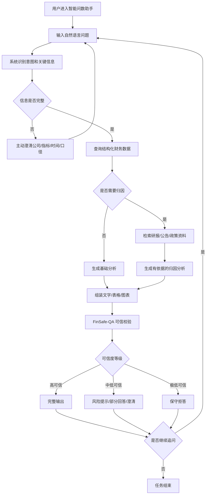

# FinSafe-QA PRD

> 本文档为项目早期的整体产品设计，覆盖从问数到归因分析的完整链路。各版本的具体实现范围为：[v1.0 PRD](v1.0/【v1.0】PRD.md)（可信问数）、[v2.0 PRD](v2.0/【v2.0】PRD.md)（分析与可视化）、[v3.0 PRD](v3.0/【v3.0】PRD.md)（上下文与规划）。版本间差异以各版本 PRD 为准。

[TOC]

## 1. 背景

### 1.1 业务背景

在上市公司财报数据持续增长的背景下，投研人员在分析医药上市公司经营表现时，需要处理财报 PDF、结构化财务指标、券商研报、公司公告等多源信息。传统分析流程依赖人工查找、Excel 整理、SQL 查询或固定 BI 报表，效率低、门槛高，且难以支持跨公司、跨周期的连续分析。

同时，直接让大模型回答财报问题也存在明显风险：模型可能误解财务指标口径、生成不存在的字段或给出缺少依据的归因结论。金融场景对准确性和可追溯性要求较高，因此需要将大模型放在受控链路中使用，而不是让模型自由生成答案。

本项目通过三个版本的迭代，逐步验证了"大模型语义理解 + 结构化查询 + 可信校验"的核心链路：V1.0 聚焦可信问数，V2.0 增加分析与可视化，V3.0 引入上下文管理与任务规划。RAG 研报归因、多模型分层路由等能力在文档中作为后续扩展方向，当前代码未实现。

### 1.2 目标用户

证券分析师、投资研究员、医药行业研究员、财经从业者、上市公司研究人员、泛财经用户。

### 1.3 用户痛点

用户的核心痛点是财报分析链路长、多源信息割裂、查询门槛高，以及 AI 生成结果缺少可信保障。

| 用户痛点 | 具体表现 | 产品如何解决 | 实现状态 |
| :--- | :--- | :--- | :--- |
| 财报数据获取链路长 | 用户需要下载财报、定位报表、复制字段、整理表格后再分析 | 自然语言直接查数，替代手动流程 | V1.0 已实现 |
| 跨公司、跨周期对比成本高 | 多家公司、多报告期、多指标对比需要反复查找和计算 | 支持自然语言完成趋势、排名和对比分析 | V2.0 已实现 |
| 财务指标和企业名称口径复杂 | 用户表达可能包含简称、模糊指标或不完整时间 | 实体归一 + 指标映射 + 意图澄清 | V1.0 已实现 |
| 财务数据与研报解释割裂 | 数值在财报/数据库中，变动原因在研报、公告或政策资料中 | 打通结构化数据查询和 RAG 归因 | 设计阶段 |
| AI 回答可信度不足 | 大模型可能出现字段幻觉、无依据归因或错误结论 | SQL 可见 + 血统追溯 + 置信度标签 | V1.0 已实现 |

### 1.4 为什么适合用 AI

该场景适合使用 AI，是因为用户问题往往是自然语言、口语化且不完整的，需要系统理解公司、指标、时间、动作等隐含信息，并将其转化为可执行任务。传统规则或固定 BI 报表难以覆盖”查数、对比、追问、画图”连续发生的真实投研流程。

本项目中，大模型主要承担语义理解、意图识别和分析结论生成；结构化财务数据库负责保证数值准确；SQL 白名单模板和规则计算负责查询安全。后续可通过引入 RAG 知识库补充研报、公告等归因依据。核心原则是：将大模型放在可验证、可约束、可评测的产品链路中，通过结构化数据和校验机制控制幻觉风险。

### 1.5 竞品分析

本项目的竞品主要分为三类：金融数据与投研平台、通用大模型、AI 应用搭建/智能问数工具。对比重点不在于谁的数据最全，而在于谁能更好地完成“低门槛问数、研报归因、可信输出”的闭环。

| 竞品 | 核心定位 | 优势 | 局限 | 对本项目的启发 |
| :--- | :--- | :--- | :--- | :--- |
| 同花顺问财 / iFinD | 金融数据查询与智能投研平台 | 数据覆盖广，自然语言金融查询心智成熟 | 偏泛金融场景，垂直行业深度和可信链路不够突出 | 证明自然语言问财需求成立 |
| 东方财富妙想 / Choice | 金融终端 AI 助手 | 行情、资讯、公告、研报生态完整 | 偏综合金融终端，功能范围较大 | 本项目应避免大而全，聚焦财报分析闭环 |
| Wind 金融终端 / 研报平台 | 机构级金融数据与研报服务 | 数据和研报资源专业 | 使用门槛高，轻量自然语言交互不足 | 借鉴数据权威性和研报组织方式 |
| 通用大模型 | 通用问答与文本分析 | 交互自然，理解和总结能力强 | 缺少稳定财务数据源和结果回验 | 大模型只能作为受控链路中的一环 |
| Dify RAG / SchemaRAG | RAG 与 Text-to-SQL 技术方案 | 技术路径接近，搭建效率高 | 缺少财报领域口径、校验和安全策略 | 需要在通用技术上加入行业规则和可信机制 |

结论：现有竞品已验证“金融数据 + AI 交互 + 投研分析”的趋势，但要么偏泛金融平台，要么偏通用大模型或技术底座。本项目的差异化在于聚焦医药上市公司财报分析，把自然语言问数、结构化查询、研报归因和可信校验做成可验证的垂直闭环。

### 1.6 产品目标

本项目通过三个版本的渐进式迭代，逐步验证从"可信问数"到"智能分析"的产品链路。

| 版本 | 产品目标 | 核心验证点 | 状态 |
| :--- | :--- | :--- | :--- |
| V1.0 可信问数 | 自然语言稳定映射到可审计 SQL | 意图识别准确、SQL 可回放、结果可追溯 | 已实现 |
| V2.0 分析与可视化 | 在可信问数基础上增加分析结论和图表 | 分析计划、规则计算、洞察生成、图表配置 | 已实现 |
| V3.0 上下文与规划 | 让复杂多步查询变得可控 | 多轮上下文、槽位继承、任务拆解与编排 | 已实现 |
| 后续扩展 | RAG 归因、多模型路由、用户反馈闭环 | 研报证据检索、分模块模型选择、Bad Case 回流 | 设计阶段 |

各版本具体目标、提示词工程和评测体系见：[v1.0 PRD](v1.0/【v1.0】PRD.md) / [v2.0 PRD](v2.0/【v2.0】PRD.md) / [v3.0 PRD](v3.0/【v3.0】PRD.md)。模型策略演进见 [03 模型迭代与项目总结.md](03%20模型迭代与项目总结.md)。

## 2. 需求描述

### 2.1 需求概述

本项目搭建了一款医药上市公司财报智能问数助手，通过三个版本迭代逐步扩展能力。用户输入自然语言问题后，系统完成问题理解、实体识别、指标映射、SQL 生成、财务数据查询和可信校验，V2.0 起增加分析计划与图表输出，V3.0 起增加上下文管理与任务规划。

产品核心范围聚焦公开财务数据查询与分析，不扩展实时行情、交易决策、复杂估值或完整深度研报生成。系统只提供数据分析和信息归纳，不输出确定性投资建议。

### 2.2 需求清单

| 编号 | 需求名称 | 需求描述 | 实现版本 | 优先级 |
| :--- | :--- | :--- | :--- | :--- |
| R001 | 自然语言问数 | 用户可输入财报分析问题，系统识别公司、指标、时间和分析动作 | V1.0 | P0 |
| R002 | 问题重写与澄清 | 对口语化问题进行标准化；信息缺失时主动澄清 | V1.0 | P0 |
| R003 | 实体与指标映射 | 将公司简称、财务指标别名映射为标准实体和字段 | V1.0 | P0 |
| R004 | 白名单 SQL 生成 | 基于 Schema 模板生成受控 SQL，禁止自由拼接 | V1.0 | P0 |
| R005 | 财务数据查询 | 基于 AkShare/同花顺公开数据，SQLite 本地缓存 | V1.0 | P0 |
| R006 | 可信校验 | SQL 可见、数据血统、置信度评分、审计日志 | V1.0 | P0 |
| R007 | 分析计划与规则计算 | 排名、占比、增长率、研发效率等规则化计算 | V2.0 | P0 |
| R008 | 分析与可视化 | 洞察生成、图表类型推荐、前端柱状图/折线图/表格 | V2.0 | P1 |
| R009 | 上下文管理 | 多轮对话状态、追问识别、槽位继承 | V3.0 | P0 |
| R010 | 任务规划 | 复合问题拆解、任务类型标记、依赖编排 | V3.0 | P0 |
| R011 | RAG 证据检索 | 从研报、公告、政策资料中召回归因依据 | 设计阶段 | P1 |
| R012 | 用户反馈闭环 | 收集用户反馈并回流到 Bad Case 库 | 设计阶段 | P2 |

### 2.3 需求分类

#### 2.3.1 功能需求

| 功能模块 | 功能说明 | 实现版本 | 优先级 |
| :--- | :--- | :--- | :--- |
| 问题理解 | 问题重写、意图识别、槽位抽取 | V1.0 | P0 |
| 查询执行 | 白名单 SQL 生成、SQLite 查询、结构化数据返回 | V1.0 | P0 |
| 可信输出 | SQL 可见、数据血统、置信度、审计日志 | V1.0 | P0 |
| 分析与可视化 | 分析计划、规则计算、洞察生成、图表配置 | V2.0 | P0 |
| 上下文管理 | 多轮对话、追问识别、槽位继承 | V3.0 | P0 |
| 任务规划 | 复合问题拆解、任务类型标记、依赖编排 | V3.0 | P0 |
| RAG 归因 | 检索研报/公告/政策资料，生成有依据的归因分析 | 设计阶段 | P1 |
| 用户反馈 | 收集用户反馈并回流 Bad Case | 设计阶段 | P2 |

#### 2.3.2 非功能需求

| 类型 | 要求 |
| :--- | :--- |
| 响应速度 | 基础查询平均 ≤ 8 秒，复杂任务平均 ≤ 20 秒 |
| 查询稳定性 | API/SQL 查询成功率 ≥ 85% |
| 理解准确率 | 意图和槽位识别准确率 ≥ 85% |
| 实体归一 | 常见公司简称、股票简称、股票代码识别成功率 ≥ 90% |
| 系统稳定性 | 单次任务失败不影响整体服务，具备兜底策略 |

#### 2.3.3 安全与数据需求

| 类型 | 要求 |
| :--- | :--- |
| 投资建议边界 | 只做数据分析和信息归纳，不输出确定性买卖建议 |
| 数据来源 | 财务数据、研报观点和政策依据需尽量可追溯 |
| API/SQL 安全 | 仅允许只读查询，禁止写入、修改、删除操作 |
| 密钥保护 | API Key、数据库账号、模型密钥不得暴露在前端、日志或回答中 |
| 数据资产 | 需维护公司实体字典、指标字典、结构化财务数据、研报/公告/政策资料、bad case 数据 |

## 3. 大模型选择

### 3.1 当前实现

三个版本均通过 SilicoFlow OpenAI-compatible 接口调用单一可配置模型，默认使用 `Qwen/Qwen3-32B`。各模块（意图识别、洞察生成、图表校验）共享同一模型，LLM 不可用时自动回退到规则解析。

| 配置项 | 说明 |
| :--- | :--- |
| 接口 | SilicoFlow OpenAI-compatible API |
| 默认模型 | `Qwen/Qwen3-32B` |
| 模型数量 | 1（所有模块共享） |
| 兜底策略 | LLM 不可用时回退规则解析 |

### 3.2 架构设计方向

[02 AI模型选择.md](02%20AI模型选择.md) 描述了一套分模块多模型分层路由架构，将系统拆分为 6 个模块（上下文管理、意图识别、槽位抽取+Query IR+SQL 生成、任务规划、数据分析、异常修复），并为每个模块推荐不同量级的候选模型：

| 调用层级 | 使用场景 | 推荐模型 | 状态 |
| :--- | :--- | :--- | :--- |
| 轻量模型层 | 上下文管理、简单意图判断 | `Qwen/Qwen3-8B` | 设计阶段 |
| 主力模型层 | 意图识别、SQL 生成、数据分析 | `Qwen/Qwen3-32B` | 已实现 |
| 推理增强层 | 高复杂度任务规划、复杂归因 | `DeepSeek-R1-Distill-Qwen-14B` | 设计阶段 |

该分层路由架构的 engine.py 代码实现和模块级评估门禁为后续迭代方向。当前三版本均以单一主力模型验证核心链路可行性。

模型选型的完整演进过程见：[03 模型迭代与项目总结.md](03%20模型迭代与项目总结.md)。

## 4. 业务流程图

本章节从用户视角描述智能问数助手的目标主流程。以下为全链路设计，其中"是否需要归因→检索研报"分支为后续扩展方向，当前版本仅做边界识别（evidence_or_boundary），不执行 RAG 检索。

### 4.1 用户主流程（目标架构）

### 4.2 关键业务规则

| 规则 | 说明 |
| :--- | :--- |
| 信息不完整先澄清 | 缺少公司、报告期、指标或口径时，不直接猜测 |
| 数据查询先于结论生成 | 涉及财务数值的问题，必须先查结构化数据 |
| 归因必须有依据 | 原因类问题需结合研报、公告、政策资料，证据不足需说明 |
| 可视化依赖有效数据 | 数据为空或不足时不强行绘图 |
| 低可信结果不完整输出 | 触发风险提示、部分回答、澄清或拒答 |
| 不输出投资建议 | 不生成确定性买入、卖出、持有建议 |

## 5. 系统架构

系统以用户自然语言问题为输入，以可信回答为输出，中间经过问题理解、Query IR、任务规划、API/SQL 查询、RAG 检索、分析生成和 FinSafe-QA 校验。

### 5.1 核心模块说明

| 模块 | 作用 | 输出 | 实现状态 |
| :--- | :--- | :--- | :--- |
| 问题理解 | 重写问题、识别意图、抽取公司/指标/时间 | 标准化问题和槽位 | V1.0 |
| 白名单 SQL 生成 | 基于 Schema 模板生成受控 SQL | SQL 语句 | V1.0 |
| 数据查询 | 查询 SQLite 财务数据缓存 | 结构化数据结果 | V1.0 |
| 可信校验 | SQL 可见、数据血统、置信度评分、审计日志 | 可信层输出 | V1.0 |
| 分析计划与计算 | 排名、占比、增长率、研发效率等规则计算 | 分析计划和计算字段 | V2.0 |
| 图表配置 | 图表类型推荐、字段映射、单位标注 | 图表配置 JSON | V2.0 |
| 上下文管理 | 多轮对话、追问识别、槽位继承 | 重写问题和上下文元信息 | V3.0 |
| 任务规划 | 复合问题拆解、任务类型标记、依赖编排 | 子任务列表和执行批次 | V3.0 |
| RAG 检索 | 检索研报、公告、政策资料 | 证据片段和来源 | 设计阶段 |
| 异常修复 | API/SQL 执行失败时自动重试或生成修复策略 | 修复后的查询 | 设计阶段 |

### 5.2 异常处理

| 异常类型 | 处理策略 |
| :--- | :--- |
| 槽位缺失或口径不清 | 主动澄清，并给出可选项 |
| 企业实体不唯一 | 返回候选公司请用户确认 |
| API/SQL 执行失败 | 自动诊断与修复，超过次数后兜底 |
| 查询结果为空或异常 | 说明数据缺失或标记低可信 |
| RAG 证据不足 | 不做确定性归因，仅说明证据不足 |
| 可信校验不通过 | 风险提示、部分回答或保守拒答 |
| 合规风险 | 拒绝投资建议，转为数据分析和风险提示 |

## 6. 数据与知识库

本项目不进行模型微调，数据层主要由结构化财务数据、公司与指标字典组成。结构化财务数据用于支撑问数、趋势、对比和排名。RAG 证据资料（研报、公告、政策）为后续扩展方向，当前仅做边界识别。

### 6.1 数据源选择

当前版本通过 AkShare 调用同花顺公开财务数据接口，并落地为本地 SQLite 缓存：

- **数据源**：AkShare / 同花顺公开财务数据
- **缓存文件**：`data/finsafe_v1.db`（各版本独立）
- **覆盖公司**：10 家医药/CXO/创新药相关 A 股上市公司
- **覆盖期间**：2022-2024 年年度报告，2025 年三季报
- **同步命令**：`python3 -m src.public_data`

生产环境可根据数据稳定性和预算，升级为更权威的数据源：

| 数据源 | 权威性 | 接入难度 | 本项目定位 |
| :--- | :--- | :--- | :--- |
| AkShare / 同花顺 | 中，公开财经数据聚合 | 低 | 当前版本主数据源 |
| 巨潮资讯网 | 最高，法定信息披露平台 | 中高 | RAG 证据来源候选 |
| Tushare Pro | 中高，字段较稳定 | 中 | 生产候选 |
| Choice API | 高，商业终端级 | 高 | 企业级生产候选 |

### 6.2 数据类型

| 数据类型 | 数据内容 | 用途 | 状态 |
| :--- | :--- | :--- | :--- |
| 结构化财务数据 | 公司基础信息、报告期、营业收入、净利润、现金流、资产负债、研发费用等 | 支撑问数、趋势、对比、排名和同比计算 | 已实现 |
| 公司实体字典 | 公司全称、股票简称、曾用名、所属行业 | 支撑企业实体识别和归一化 | 已实现 |
| 财务指标字典 | 指标名称、别名、字段名、口径说明 | 支撑指标映射和口径澄清 | 已实现 |
| RAG 证据资料 | 巨潮公告、研报、医保政策、行业新闻等 | 支撑归因分析和来源引用 | 设计阶段 |
| Bad Case 数据 | 查询失败、字段错误、归因无依据等样例 | 支撑评测集更新和规则迭代 | 设计阶段 |

### 6.3 数据维护原则

- 结构化财务数据通过 `public_data.py` 同步至本地 SQLite，保证公司、报告期、指标字段和数值口径一致；
- 数据表结构通过 `src/prompts.py` 的 `SCHEMA_CONTEXT` 暴露给大模型，约束 SQL 生成只能在白名单字段范围内；
- 涉及归因分析时（后续 RAG 阶段），优先引用巨潮公告、研报或政策资料，不依赖无来源推断；
- 查询失败、字段不匹配、结果异常等 Bad Case 需要回流，用于优化字段映射和兜底规则。

## 7. 评测体系

评测体系按版本分层设计，每个版本的评测重点与其产品目标对齐。

### 7.1 三版本评测概览

| 版本 | 评测文档 | 问题集 | 数量 | 评测重点 |
| :--- | :--- | :--- | :--- | :--- |
| V1.0 | [v1.0 项目评测](v1.0/【v1.0】项目评测.md) | `data/【v1.0】评测问题集.xlsx` | 103 条 | 准确性、系统性、可回溯性 |
| V2.0 | [v2.0 项目评测](v2.0/【v2.0】项目评测.md) | `【v2.0】测试数据集.xlsx` | 29 条 | 分析质量、可视化质量、边界处理 |
| V3.0 | [v3.0 项目评测](v3.0/【v3.0】项目评测.md) | `【v3.0】测试数据集.xlsx` | 79 条 | 上下文记录、任务类型覆盖、依赖关系有效性 |

### 7.2 V1.0 评测：可信问数

V1.0 将问题按 SQL 复杂度分为三级：1 级(直接查)、2 级(统计计算)、3 级(多步拆解)。1/2 级为核心上线门禁，3 级为挑战集。

| 指标 | 上线要求 | 结果 |
| :--- | :--- | :--- |
| 1 级问题准确率 | ≥ 99% | 100% |
| 2 级问题准确率 | ≥ 90% | 94.4% |
| 致命错误率 | 0% | 0% |
| SQL 可见率 / 数据血统完整率 / 审计日志完整率 | 100% | 100% |

### 7.3 V2.0 评测：分析与可视化

V2.0 新增分析和可视化质量维度，并引入边界处理评估（对超出数据覆盖范围的问题是否正确识别并提示）。

| 维度 | 说明 |
| :--- | :--- |
| analysis_quality | 分析类型正确、计算结果准确、边界问题正确识别 |
| visual_quality | 图表类型合理、标题/单位/数据源完整 |
| traceability | SQL 可见、Query ID、源表字段可追溯 |

### 7.4 V3.0 评测：上下文与规划

V3.0 只评测新增的上下文管理和任务规划模块，不重复 V1/V2 的答案正确率指标。

| 维度 | 说明 |
| :--- | :--- |
| decomposition_pass | 复合问题是否被正确拆解为子任务 |
| task_type_pass | 子任务类型（query/calculation/evidence_or_boundary/analysis/visualization）是否覆盖预期 |
| dependency_pass | 任务依赖关系和执行批次是否有效 |
| context_record_pass | 会话状态和槽位继承是否正确记录 |
| follow_up_pass | 多轮追问是否被正确识别和处理 |

### 7.5 一票否决项（全版本通用）

- 编造财务数值或不存在的数据；
- 公司、报告期或核心指标识别错误，且未触发澄清；
- 输出明确买入、卖出、持有等投资建议；
- 暴露 API Key、系统 Prompt 或内部接口敏感信息；
- SQL 生成包含写入、删除、修改等非只读操作。

### 7.6 Bad Case 回流（后续方向）

Bad Case 应按类型（公司识别错误、指标口径错误、报告期错误、SQL 生成错误、边界识别遗漏、安全合规风险等）分类回流，用于更新实体字典、指标字典、字段映射和兜底规则。当前版本尚未建立自动化回流管线。

评测演进和模型升级门禁详见 [03 模型迭代与项目总结.md](03%20模型迭代与项目总结.md)。
