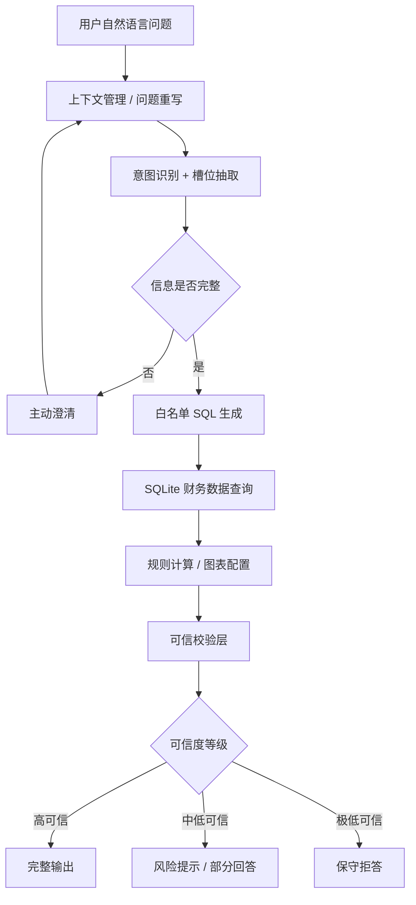

# FinSafe-QA

面向医药上市公司财报场景的 AI 问数产品——验证大模型必须在可约束、可验证、可评测的产品链路中工作，而非自由生成。

---

## 目标用户

证券分析师、投资研究员、医药行业研究员，以及需要快速查询医药上市公司财务数据的财经从业者。

---

## 用户 & 痛点

| 痛点 | 表现 | 纯 RAG 能解决吗 |
| :--- | :--- | :--- |
| 财报数据获取链路长 | 下载 PDF → 定位报表 → 复制字段 → Excel 整理 → 分析 | 不能——RAG 检索到的片段不会自动对齐字段口径 |
| 跨公司/跨周期对比成本高 | 多家公司、多报告期、多指标的反复查找 | 不能——RAG 没有结构化计算能力 |
| 指标和公司名称口径复杂 | 用户说"药明去年赚了多少"，需映射到"药明康德 2024 归母净利润" | 部分能——但 RAG 无法保证口径一致 |
| AI 回答可信度不足 | 大模型会编造财务数值、不存在的字段、无依据的归因 | 不能——反而增加幻觉来源 |

---

## 为什么不用纯 RAG

纯 RAG（检索增强生成）在财报分析场景存在系统性问题：

1. **数值幻觉**：RAG 检索到的财报片段可能包含数值，但模型在组装回答时可能改写、计算错误或张冠李戴。财务场景对数值零容忍。
2. **计算不可信**：排名、占比、增长率、研发效率等计算，不能交给模型在心智中完成——一个幻觉就能得出错误结论。
3. **口径不可审计**：RAG 难以保证同一字段在多轮对话中口径一致，用户无法追溯"这个数字来自哪张表的哪个字段"。

**FinSafe-QA 的核心选择**：大模型只做语义理解（意图识别、实体抽取、洞察表达），查询走白名单 SQL，计算走规则层代码。每一步都可审计、可回放。

---

## 系统架构



核心原则：**大模型负责"理解"，系统负责"查询"和"计算"，可信层负责"校验"**。

---

## 核心能力

| 能力 | 版本 | 说明 |
| :--- | :--- | :--- |
| 自然语言转白名单 SQL | V1.0 | 基于 Schema 模板，模型不直接拼接 SQL |
| SQL 可见 + 数据血统 + 置信度 | V1.0 | 每次查询返回 SQL、参数、源表字段、查询 ID |
| 分析计划与规则计算 | V2.0 | 排名/占比/增长率/研发效率等由代码计算，不由模型 |
| 图表配置与可视化 | V2.0 | 模型推荐图表类型，系统校验字段和单位 |
| 多轮上下文 + 槽位继承 | V3.0 | 代码层状态机，不依赖模型"记住"上下文 |
| 自主任务规划 | V3.0 | 复合问题拆解为 query/calculation/analysis/visualization/evidence_or_boundary |

---

## 评测结果

### Eval 指标

| 版本 | 评测集 | 结果 | 核心发现 |
| :--- | :--- | :--- | :--- |
| V1.0 | 103 条 | 80/103，77.7% | 1/2 级核心门禁达标（100%/94.4%），3 级挑战集暴露复杂归因短板 |
| V2.0 | 29 条 | 27/29，93.1% | 分析/可视化/可回溯三维度均 100%；2 条未通过为开放性政策判断（超出数据边界） |
| V3.0 | 79 条 | 79/79，100% | 验证新增规划模块规则覆盖率；不等同于最终答案正确率 |

### Bad Case（真实评测暴露）

| 类型 | 问题示例 | 根因 | 修复 |
| :--- | :--- | :--- | :--- |
| 指标口径不清 | "分析药明康德的利润增长质量" | "利润增长质量"无标准字段映射 | 增加指标口径词典和澄清反问机制 |
| 多步拆解遗漏 | "找出研发费用率最高的3家公司并分析其收入趋势" | 排名 + 趋势两个目标未完整拆解 | V3.0 任务规划器自动拆解为 query → calculation → analysis |
| 归因无数据支撑 | "中美地缘政治对CXO企业的影响会持续多久" | 结构化数据无研报/政策/订单信息 | 规划为 evidence_or_boundary 任务，不强行回答 |
| 过度继承上下文 | 带 ①②③ 的完整问题被误判为追问 | 序号触发追问检测但实际是新问题 | 增加防过度继承规则 |
| 归因题缺查询前置 | "分析药明康德营收下降的原因" | 只生成 analysis，未先查数 | 自动补充 query 作为前置任务 |

---

## 产品迭代

| 版本 | 目标 | 核心假设 | 验证结果 |
| :--- | :--- | :--- | :--- |
| [V1.0](v1.0/) | 可信问数 | 自然语言能稳定映射到可审计 SQL | 通过——白名单 Schema + 模板约束 |
| [V2.0](v2.0/) | 可信分析与可视化 | 在查数可信基础上叠加分析结论 | 通过——规则计算 + 图表配置 |
| [V3.0](v3.0/) | 上下文与自主规划 | 复杂多步查询能变得可控 | 通过——上下文管理 + 任务规划编排 |
| 后续 | RAG 归因 / 多模型路由 | 外部证据检索和成本优化 | 设计阶段 |

迭代原则：**先可信、再好用、最后智能**——每个版本只验证一个核心假设。

---

## Demo

### 产品截图

**V1.0 可信问数**


**V2.0 分析与可视化**


**V3.0 上下文与自主规划**


### 演示视频

[`demo演示.mov`](demo演示.mov) — 第三版本产品功能演示。

---

## 技术栈

Python · SQLite · 原生 HTML/CSS/JavaScript · AkShare/同花顺公开财务数据 · OpenAI-compatible LLM API · 白名单 SQL 模板引擎

### 本地运行

```bash
cd v3.0
python3 -m pip install -r requirements.txt
python3 server.py
# http://127.0.0.1:8765
```

### 项目文档

| 文档 | 说明 |
| :--- | :--- |
| [01 PRD.md](01%20PRD.md) | 整体产品设计（含三版本需求、架构、评测体系） |
| [02 AI模型选择.md](02%20AI模型选择.md) | 模型选型与分模块多模型路由设计 |
| [03 模型迭代与项目总结.md](03%20模型迭代与项目总结.md) | 三版本模型策略演进与设计-实现差距分析 |
| [v1.0/](v1.0/) | 可信问数：PRD、提示词、评测、代码 |
| [v2.0/](v2.0/) | 分析与可视化：PRD、提示词、评测、代码 |
| [v3.0/](v3.0/) | 上下文与规划：PRD、提示词、评测、代码 |
