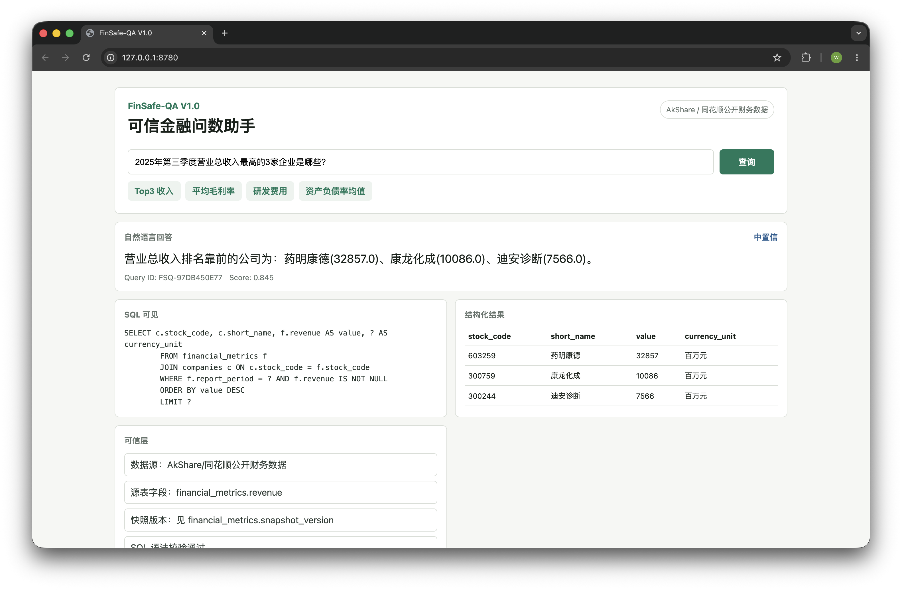
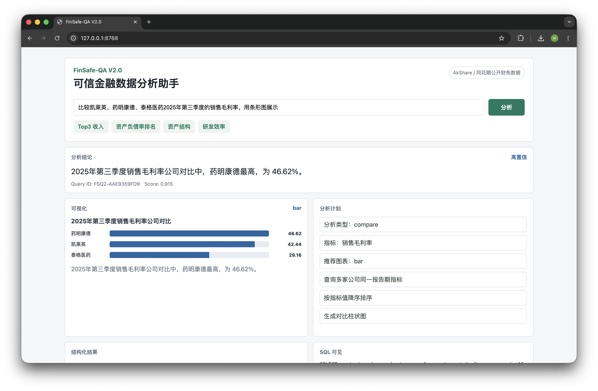
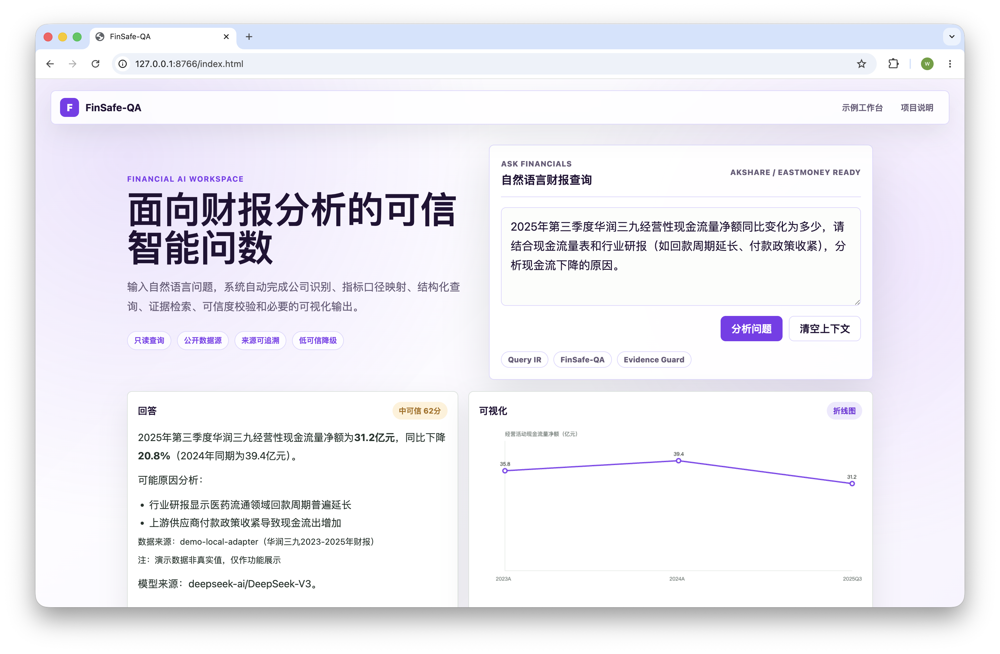
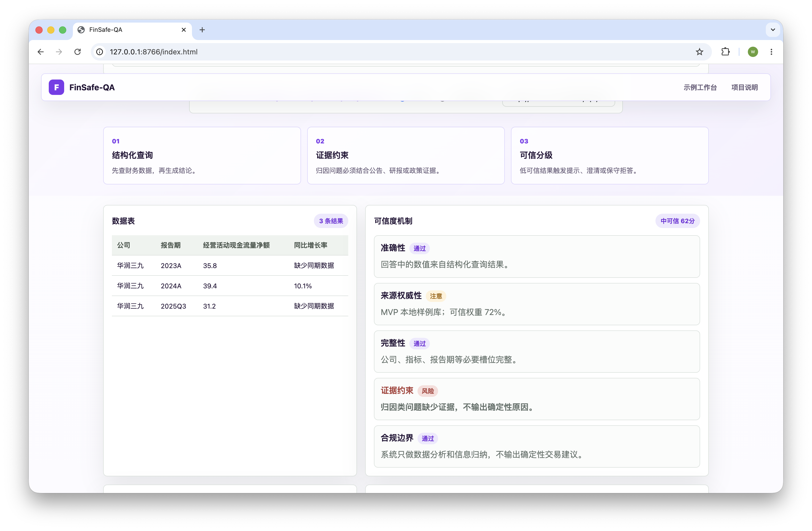

# FinSafe-QA

面向医药上市公司财报分析场景的 AI 问数项目，聚焦 AI 产品从可信问数底座到分析可视化，再到上下文与自主规划能力的渐进式迭代过程。

> 项目主线：场景定义 → PRD → AI Workflow → 提示词工程 → 评测体系 → 产品验证 → 版本复盘

---

## 项目背景

金融投研场景对 AI 的核心要求不是“回答流畅”，而是“结果可信”。用户在分析上市公司财报时，经常需要处理公司简称、财务指标口径、报告期、跨公司对比、趋势变化和复杂追问。如果直接让大模型自由回答，容易出现字段幻觉、数值编造、无依据归因和边界不清等问题。

FinSafe-QA 选择一个相对聚焦的场景：医药上市公司公开财务数据问数与分析。项目通过结构化 SQL 查询、数据血统、置信度、分析计划、图表配置和任务规划等机制，把大模型能力放进可解释、可评测的产品链路中。

---

## 三阶段迭代

| 版本 | 产品目标 | 核心能力 | 评测重点 |
| --- | --- | --- | --- |
| [v1.0](v1.0/) | 可信问数 | 自然语言转 SQL、结构化数据查询、SQL 可见、数据血统、置信度 | 准确性、系统性、可回溯性 |
| [v2.0](v2.0/) | 可信分析与可视化 | 分析计划、规则计算、洞察生成、图表配置、边界提示 | 分析质量、可视化质量、边界处理 |
| [v3.0](v3.0/) | 上下文增强的自主规划 | 多轮上下文、槽位继承、复杂问题拆解、任务依赖编排 | 上下文记录、任务类型覆盖、依赖关系有效性 |

这三个版本对应产品风险的逐步收敛：

1. **先可信**：先证明自然语言问数能稳定落到可审计 SQL。
2. **再好用**：在查数可信后，补上分析结论和可视化表达。
3. **最后智能**：在单轮分析可用后，再引入上下文和复杂任务规划。

---

## 核心链路

```text
用户问题
  -> 问题理解 / 上下文管理
  -> 公司实体与指标口径映射
  -> SQL / 分析计划 / Agent Plan
  -> 结构化财务数据查询
  -> 规则计算与图表配置
  -> 数据血统、置信度和边界提示
  -> 文字结论 / 表格 / 图表 / 可信层
```

说明：当前项目以结构化公开财务数据为主，RAG 研报/政策证据链在文档中作为后续扩展方向和边界识别对象，不包装成已完整生产化能力。

---

## 产品截图

### V1.0 可信问数



### V2.0 分析与可视化



### V3.0 上下文与自主规划





---

## 已实现能力

| 能力 | 状态 | 说明 |
| --- | --- | --- |
| 自然语言问数 | 已实现 | 支持公司、报告期、指标识别，并生成白名单 SQL |
| 结构化财务数据库 | 已实现 | 基于 AkShare / 同花顺公开财务数据落地 SQLite 缓存 |
| SQL 可见与数据血统 | 已实现 | 返回 SQL、参数、源表字段、查询 ID 和审计信息 |
| 分析计划与规则计算 | 已实现 | 支持排名、占比、研发效率、资产负债率、趋势等 |
| 图表配置与前端展示 | 已实现 | 支持柱状图、折线图、表格等基础展示 |
| 上下文管理 | 已实现 | 支持最近会话状态、追问识别、槽位继承和问题重写 |
| 多意图自主规划 | 原型已实现 | 支持 query/calculation/evidence_or_boundary/analysis/visualization 任务拆解 |
| RAG 证据链 | 规划中 | 当前仅做证据/边界识别，未接入完整研报知识库 |
| 用户反馈闭环 | 规划中 | 尚未接入真实用户反馈和 Bad Case 自动回流 |
| 观测体系 | 规划中 | 尚未做 token、延迟、模块成功率等线上观测 |

---

## 评测结果

| 版本 | 测试集 | 本轮结果 | 说明 |
| --- | --- | --- | --- |
| v1.0 | 103 条问数问题 | 80/103，通过率 77.7% | 1/2 级核心上线集达标，3 级作为挑战集观察 |
| v2.0 | 29 条分析与可视化问题 | 27/29，通过率 93.1% | 2 条开放性外部判断问题不计入核心承诺 |
| v3.0 | 79 条上下文与规划问题 | 79/79，模块覆盖率 100.0% | 只验证新增规划模块链路，不等同于最终金融回答正确率 |

评测文档：

- [v1.0 项目评测](v1.0/【v1.0】项目评测.md)
- [v2.0 项目评测](v2.0/【v2.0】项目评测.md)
- [v3.0 项目评测](v3.0/【v3.0】项目评测.md)

---

## 设计取舍

| 取舍 | 选择 | 原因 |
| --- | --- | --- |
| 大模型是否直接生成 SQL | 不直接自由生成 | 金融问数需要字段白名单、可回放和可审计 |
| 是否一开始做完整 Agent | 拆成三阶段 | 先降低数据准确性风险，再扩展分析和规划能力 |
| 复杂归因是否强行回答 | 不强行回答 | 当前结构化财务数据不足以支持完整经营归因 |
| v3.0 是否评测最终答案 | 只评测新增模块 | v3.0 目标是上下文和规划链路，不重复 v1/v2 指标 |

---

## 技术栈

- Python 标准库 HTTP Server
- SQLite
- 原生 HTML / CSS / JavaScript
- AkShare / 同花顺公开财务数据
- OpenAI-compatible LLM API 接口预留
- Markdown PRD、提示词工程和评测文档

---

## 本地运行

每个版本都可独立运行。以 v3.0 为例：

```bash
cd v3.0
python3 -m pip install -r requirements.txt
python3 server.py
```

打开：

```text
http://127.0.0.1:8765
```

运行评测：

```bash
python3 evaluate.py
```

---

## 目录结构

| 目录/文件 | 说明 |
| --- | --- |
| `v1.0/` | 可信问数版本：PRD、提示词、评测、Web 前端 |
| `v2.0/` | 数据分析与可视化版本：PRD、提示词、评测、Web 前端 |
| `v3.0/` | 上下文与自主规划版本：PRD、提示词、评测、Web 前端 |
| `01 PRD.md` | 早期完整项目 PRD 草稿 |
| `02 AI模型选择.md` | 模型选型与分层路由设计 |
| `03 模型迭代与项目总结.md` | 三版本模型策略演进与未来迭代方向 |
| `demo演示.mov` | 产品演示素材 |

---

## 项目总结与复盘

### 核心命题验证

FinSafe-QA 通过三个版本验证了一条核心判断：**金融 AI 产品的可信度不取决于模型本身有多强，而取决于产品链路是否把模型放在可约束、可验证、可评测的位置。**

三个版本对应风险逐步收敛的路径：

1. **V1.0 先可信**：证明自然语言能稳定映射到可审计 SQL，通过白名单 Schema、字段约束和模板化生成消除字段幻觉。
2. **V2.0 再好用**：在查数可信后叠加分析计划、规则计算和图表配置，用代码层计算替代模型"自由发挥"。
3. **V3.0 最后智能**：通过上下文管理和任务规划编排，让复杂查询变得可控，不追求模型自主性突破。

### 关键设计决策

| 决策 | 选择 | 理由 |
| :--- | :--- | :--- |
| SQL 由谁生成 | 白名单模板，禁止模型自由拼接 | 金融场景需要字段可审计、查询可回放 |
| 计算由谁完成 | 规则层（Python），不由模型 | 排名/占比/增长率等计算不允许模型"算出来" |
| 可视化由谁配置 | 模型推荐 + 规则校验 | 模型推荐图表类型，系统校验字段和单位 |
| 上下文由谁管理 | 代码层状态机 | 不依赖模型"记住"上下文，由系统显式记录 |
| 任务由谁规划 | 代码层拆解 + 模板 | 先解析问题中的序号/关键词，再套用任务模板 |
| 归因由谁支撑 | 暂不做，仅边界识别 | 结构化数据不足以支撑经营归因，不强行包装能力 |

### 项目复盘

**做得好的**：
- 三个版本边界清晰，每个版本只验证一个核心假设，不堆砌功能
- 评测体系与版本目标一一对应，V3.0 明确只测新增模块不重复 V1/V2 指标
- 规则 + 模型的分工模式在金融场景中比纯模型生成更可控

**可改进的**：
- 多模型分层路由（02 文档设计）尚未落地，当前单一模型已能满足核心链路，分模块路由可作为成本优化方向
- 缺少实际用户反馈数据，评测结果来自预设问题集，不代表真实使用分布

### 
