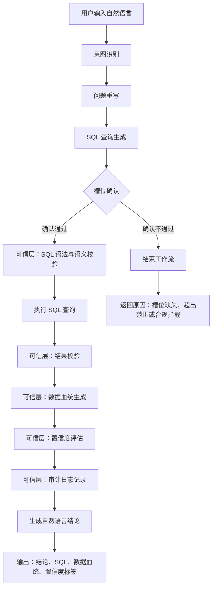
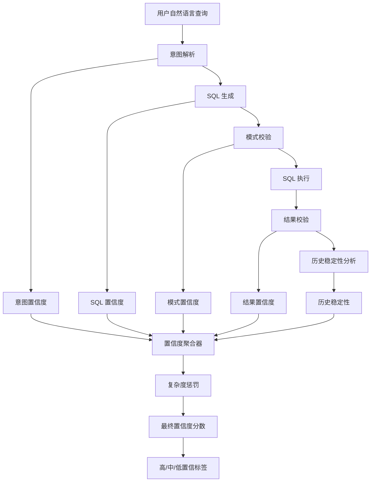

# 【v1.0】FinSafe-QA PRD

## 1. 项目概述

### 1.1 项目名称

FinSafe-QA V1.0

---

### 1.2 产品定位

FinSafe-QA V1.0 是一款面向金融投研场景的 AI 智能问数助手，核心链路为：

> 自然语言提问 → SQL 自动生成 → 结构化数据查询 → 自然语言结果回复

V1.0 的定位不是"什么都能回答"，而是优先构建可信的数据查询底座，重点解决金融数据查询中的准确性、稳定性与可追溯性问题。

---

## 2. 项目背景

当前金融投研团队在进行财务数据分析时，仍大量依赖人工查数流程，包括下载财报、定位报表字段、复制数据、手动整理表格等。

在跨公司、跨周期的数据分析场景下，传统方式存在查询效率低、数据口径不统一、人工操作成本高等问题。同时，投研人员通常缺乏 SQL 能力，而通用 AI 产品又容易出现字段幻觉、数值编造等可信度问题。

随着大模型自然语言理解能力的成熟，金融场景对"准确"和"可信"的需求正在快速提升。FinSafe-QA V1.0 聚焦于构建可信问数能力，通过自然语言交互降低数据使用门槛，并通过 SQL 可见、数据血统追溯、置信度标签等机制，提升 AI 查询结果的可靠性。

---

## 3. 目标用户

FinSafe-QA V1.0 面向金融投研相关从业人员，包括研究员、分析师、基金经理及企业战略分析团队，帮助其快速、准确地完成财务数据查询与对比分析。

---

## 4. 用户痛点分析

| 痛点 | 具体表现 | V1.0 如何解决 |
| --- | --- | --- |
| 财报数据获取链路长 | 下载 PDF → 定位报表 → 复制字段 → 整理表格 | 自然语言直接查数，替代手动流程 |
| 跨公司/跨周期对比成本高 | 多家公司、多报告期、多指标对比需反复查找 | 一次提问完成对比查询 |
| 财务指标/企业名称口径复杂 | 简称、代码、模糊指标、口语化表达 | 实体归一 + 指标映射 + 意图澄清 |
| SQL 查询门槛高 | 投研人员通常不具备 SQL 能力 | 系统自动生成 SQL，用户零代码 |
| AI 回答可信度不足 | 字段幻觉、数值编造、无依据结论 | SQL 可见 + 血统追溯 + 置信度标签 |

---

## 5. 为什么使用大模型

金融投研场景中的数据查询，是一个同时涉及语义理解、金融实体识别、指标映射、时间解析、查询意图推理、SQL 生成和结果解释的复杂任务。

传统 BI 或规则系统通常依赖固定字段、固定模板及人工配置，能够解决结构化、标准化的问题，但难以处理金融场景中大量存在的自然语言表达与口语化问题。

例如：

- "药明去年赚了多少钱"
- "凯莱英最近几个季度利润怎么样"
- "医药公司里 ROE 高但负债低的公司有哪些"

这类问题同时包含企业别名、时间推理、指标映射、多条件组合及行业语义理解，仅依赖传统规则系统或固定 API 难以覆盖。

---

### 5.1 自然语言理解能力

大模型能够理解用户口语化、非标准化的金融表达，降低使用门槛。

| 用户表达 | 标准语义 |
| --- | --- |
| 药明 | 药明康德 |
| 赚了多少钱 | 净利润 |
| 最近几个季度 | 最近连续季度 |

---

### 5.2 SQL 动态生成能力

金融投研场景的问题天然具有长尾特征。

用户的问题组合是“公司 × 时间 × 指标 × 条件 × 行业 × 对比维度”的交叉组合，理论上会形成海量查询组合。

如果完全依赖预置 API 或固定 SQL 模板：

- 开发成本极高
- 长尾问题覆盖能力有限
- 系统扩展性差

大模型能够基于语义动态生成 SQL，从而提升系统灵活性与可扩展能力。

---

### 5.3 金融语义推理能力

部分查询不仅是简单取数，还涉及金融逻辑理解。例如：同比/环比、ROE、滚动周期、行业对比、财务聚合关系等，大模型能够辅助完成复杂意图拆解与推理。

---

### 5.4 为什么不采用单一 RAG 方案

FinSafe-QA V1.0 不采用"纯 RAG"方案，核心原因在于：

> RAG 更适合"文档检索"，而非"结构化精准计算"。

在金融问数场景中，用户真正需要的是精确数值、可计算结果、可验证 SQL 和可复现查询链路，而不是仅返回相关文本片段。

单一 RAG 存在以下问题：

| 问题 | 表现 |
| --- | --- |
| 无法保证数值准确 | 检索到相近文本，但数值可能错误或过期 |
| 无法完成复杂计算 | 难以处理聚合、排序、同比、筛选等逻辑 |
| 缺乏结构化约束 | 文本生成容易出现字段幻觉 |
| 不具备 SQL 可审计性 | 用户无法验证真实查询逻辑 |
| 查询不可复现 | 同一问题可能返回不同片段 |

因此，FinSafe-QA V1.0 采用：

> "大模型语义理解 + SQL 查询执行"

而非"纯 RAG 文档问答"路线。

RAG 在系统中的角色更多是指标解释、财报原文引用、辅助语义召回和元数据增强，而非核心取数链路。

---

## 6. 竞品分析

### 6.1 WarrenQ（恒生聚源）

| 维度 | 做法 | 效果 |
| --- | --- | --- |
| 准确性 | NL2API 路线（不依赖实时 SQL 生成），预置 3000+ 金融指标 API；AIDB 三表体系 + SWOD 极简查询范式 | 某城商行投顾场景取数准确率 95%+ |
| 稳定性 | API 输入输出固定；元数据层隔离模式变更；DeepSeek 深度思维链可暴露异常推理过程 | 相比 NL2SQL 更稳定，但灵活性受限 |
| 可解释性 | 提供智能体全链路日志、取值追踪、引用溯源、提示词调试 | 开发者级白盒能力 |

**局限：**

- 查询范围受限于预置 API
- 无法处理开放式长尾问题
- SQL 对用户不可见
- 无法实现 SQL 审计

---

### 6.2 WindClaw / Alice（万得）

| 维度 | 做法 | 效果 |
| --- | --- | --- |
| 准确性 | MCP 工具封装；Wind 数据库直连；智能体自动路由 | 未公开具体准确率 |
| 稳定性 | MCP 工具具备固定契约；本地化部署；多智能体协同 | 工具层稳定性较高 |
| 可解释性 | 数据来源保留；逻辑链路记录；阶段校验；可编辑底稿 | 结果可核验、可复盘 |

**局限：**

- SQL 被封装在 MCP 内部
- 用户无法查看真实执行的查询
- 多智能体仲裁机制不透明
- 查询复现性未公开验证

---

### 6.3 竞品共同问题

当前主流金融 AI 问数产品，本质上都在"绕开 NL2SQL 的可信挑战"。

| 维度 | WarrenQ | WindClaw | 共同问题 |
| --- | --- | --- | --- |
| 准确性策略 | 绕开 SQL 生成 | 隐藏 SQL 生成 | 未真正解决 NL2SQL 可信问题 |
| SQL 可见性 | 不可见 | 不可见 | 用户无法审计 |
| 数据溯源粒度 | API 级 | 工具级 | 未到源表字段级 |
| 查询可复现性 | 天然保证 | 未披露 | 多智能体体系存在不确定性 |
| 模型升级管理 | 已切换基座模型 | 未披露 | 回归测试机制不透明 |

---

## 7. 系统整体设计

### 7.1 产品设计理念

FinSafe-QA V1.0 不追求"大而全"的智能体能力，而是聚焦于：

> 金融语义与数据库语法之间的精准映射。

核心目标：

- 让自然语言稳定映射到结构化 SQL
- 让查询链路可解释、可验证
- 让结果具备可复现性
- 让 AI 输出具备金融级可信度

---

### 7.2 系统流程图



---

## 8. 置信度体系

### 8.1 设计目标

置信度并非模型主观输出，而是基于整个查询链路的综合评分。

---

### 8.2 置信度流程图



---

### 8.3 置信度组成

| 模块 | 作用 |
| --- | --- |
| 意图置信度 | 意图解析可信度 |
| SQL 置信度 | SQL 生成可信度 |
| 模式置信度 | 模式匹配可信度 |
| 结果置信度 | 结果合理性 |
| 历史稳定性 | 历史稳定性 |
| 复杂度惩罚 | 查询复杂度惩罚 |

---

### 8.4 最终计算公式

```text
最终置信度 =
    0.25 × 意图置信度
  + 0.25 × SQL 置信度
  + 0.15 × 模式置信度
  + 0.20 × 结果置信度
  + 0.10 × 历史稳定性
  - 0.05 × 复杂度惩罚
```

---

### 8.5 用户侧展示

```text
🟡 中置信

原因：
- 指标"利润"存在多种口径
- 查询涉及 3 表 JOIN
- SQL 已通过语法与语义校验
- 数据结果无异常波动
```

---

## 9. 项目评测

模型测评、测试集管理、自动回归、人工评测及模型升级门禁，详见`【v1.0】项目评测`。PRD 中仅保留与产品上线相关的核心评测维度和门禁指标。

| 评测维度 | 评测重点 | 上线指标 |
| --- | --- | --- |
| 准确性 | 判断系统是否能把自然语言问题正确转化为 SQL，并返回与标准答案一致的查询结果 | 1 级问题准确率 ≥ 99%；2 级问题准确率 ≥ 90%；致命错误率 = 0%；静默错误率 ≤ 5% |
| 系统性 | 判断系统是否稳定覆盖核心问数场景，包括公司、时间、指标、对比、排序、同比/环比等常见组合 | 核心场景覆盖率 = 100%；自动回归通过率 = 100%；模型升级后准确率下降 ≤ 5%；边界扰动稳定性 ≥ 90% |
| 可回溯性 | 判断每次查询是否具备可解释、可复现、可审计能力，避免结果无法验证 | SQL 可见率 = 100%；数据血统完整率 = 100%；审计日志完整率 = 100%；SQL 可回放成功率 ≥ 95% |
