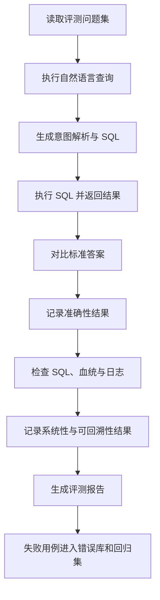

# 【v1.0】项目评测

## 1. 评测目的

本文档用于定义 FinSafe-QA V1.0 的模型评测体系，重点验证系统在金融问数场景下的准确性、系统性和可回溯性。

V1.0 评测不以开放式金融分析能力为核心目标，而是优先验证：

- 自然语言问题能否被正确理解并转化为 SQL。
- SQL 查询结果是否与标准答案一致。
- 查询链路是否稳定、可复现、可审计。
- 输出结果是否具备可解释依据，而不是仅给出自然语言结论。

## 2. 评测数据来源

本次评测使用以下数据集文件：

| 文件 | 用途 |
| --- | --- |
| `【v1.0】评测问题集.xlsx` | V1.0 模型评测问题集，包含问题编号、问题类型、问题文本和难度等级 |
| `评测说明.md` | 评测问题难度分级说明 |

评测问题集当前共包含 **103 条问题**。

| 难度等级 | 数量 | 定位 |
| --- | ---: | --- |
| 1 级 | 25 | V1.0 核心上线评测集 |
| 2 级 | 18 | V1.0 核心上线评测集 |
| 3 级 | 60 | 挑战集/观察集，不作为 V1.0 强上线门禁 |

| 问题类型 | 数量 |
| --- | ---: |
| 数据基本查询 | 25 |
| 数据统计分析查询 | 24 |
| 归因分析 | 14 |
| 多意图 | 13 |
| 融合查询 | 13 |
| 数据校验 | 6 |
| 开放性问题 | 5 |
| 归因分析；多意图 | 3 |

## 3. 难度分级

本难度分级仅从“自然语言问题生成 SQL 查询语句”的复杂度出发进行评估，不考虑业务分析、结果解释或金融专业知识难度。

### 3.1 1 级：直接查

1 级问题对应能够通过单表或简单条件筛选直接完成的查询。

典型特征：

- 单一查询目标。
- 字段含义明确。
- 条件简单，如公司、年份、指标。
- 通常不需要聚合计算或复杂关联。

典型 SQL 特征：

- `SELECT + WHERE`
- 简单字段查询

示例：

- 查询某公司某年的营业收入。
- 查询某项费用金额。
- 查询某季度净利润。

### 3.2 2 级：需要统计计算

2 级问题对应需要进行统计计算、聚合分析或简单多表关联的查询。

典型特征：

- 存在统计或计算逻辑。
- 涉及排序、分组、占比等分析。
- 可能需要 2-3 张表关联。
- 需要一定 SQL 逻辑推导。

典型 SQL 特征：

- `GROUP BY`
- `ORDER BY`
- 聚合函数，如 `SUM`、`AVG`
- 简单 `JOIN`

示例：

- 查询收入增长率。
- 查询行业平均毛利率。
- 查询 TopN 企业。
- 查询同比/环比变化。

### 3.3 3 级：需要多步 SQL 逻辑拆解

3 级问题对应需要多步推理、复杂关联或高级 SQL 结构的查询。

典型特征：

- 多个查询目标或多重条件组合。
- 涉及复杂时间口径。
- 存在嵌套查询、窗口函数或多阶段计算。
- 可能需要拆解为多个 SQL 步骤完成。

典型 SQL 特征：

- 多层嵌套查询。
- CTE。
- 窗口函数。
- 多表复杂关联。
- 多指标联合分析。

3 级问题在 V1.0 中作为挑战集和能力观察集，用于判断模型上限、发现长尾问题和规划后续版本优化方向，不作为 V1.0 强上线门禁。

## 4. 评测维度

### 4.1 准确性

准确性用于判断系统是否能把自然语言问题正确转化为 SQL，并返回与标准答案一致的查询结果。

核心关注点：

- 意图识别是否正确。
- 公司、时间、指标、口径等关键槽位是否完整。
- SQL 是否查对表、查对字段、查对时间范围。
- 查询结果是否与标准答案一致。
- 是否存在 SQL 可执行但结果错误的静默错误。

上线指标：

| 指标 | 要求 |
| --- | --- |
| 1 级问题准确率 | ≥ 99% |
| 2 级问题准确率 | ≥ 90% |
| 致命错误率 | 0% |
| 静默错误率 | ≤ 5% |

致命错误包括：查错表、查错字段、时间范围错误、单位错误、缺失关键过滤条件、返回与问题无关的结果。

### 4.2 系统性

系统性用于判断评测是否覆盖 V1.0 核心问数能力，而不是只验证少量孤立问题。

核心关注点：

- 是否覆盖基础取数、统计分析、多公司对比、数据校验等核心场景。
- 是否覆盖公司、时间、指标、排序、聚合、同比/环比等常见组合。
- 同一语义的不同表达是否能返回一致结果。
- 模型、提示词或解析规则调整后，历史能力是否保持稳定。

上线指标：

| 指标 | 要求 |
| --- | --- |
| 核心场景覆盖率 | 100% |
| 自动回归通过率 | 100% |
| SQL 语义等价率 | ≥ 95% |
| 边界扰动稳定性 | ≥ 90% |
| 模型升级后准确率下降 | ≤ 5% |

其中，核心场景覆盖至少应包含：数据基本查询、数据统计分析查询、数据校验、多意图查询和融合查询。

### 4.3 可回溯性

可回溯性用于判断每次查询是否具备可解释、可复现、可审计能力。

核心关注点：

- 是否展示或记录最终 SQL。
- 是否记录原始问题、意图解析结果和关键槽位。
- 是否能够追溯结果对应的数据表、字段和数据快照。
- 是否支持基于同一 SQL 和快照版本回放查询。
- 是否保留审计日志，便于问题定位和回归测试。

上线指标：

| 指标 | 要求 |
| --- | --- |
| SQL 可见率 | 100% |
| 数据血统完整率 | 100% |
| 审计日志完整率 | 100% |
| SQL 可回放成功率 | ≥ 95% |
| 查询 ID 生成率 | 100% |

## 5. 评测流程

## 6. 评测结果

> 说明：以下结果为执行 `evaluate.py` 后得到的 V1.0 评测运行结果。评测过程逐条调用查询引擎，记录 SQL、查询 ID、答案、置信度和通过状态。

### 6.1 整体结论

本轮评测共覆盖 103 条问题，其中 1 级和 2 级问题作为 V1.0 核心上线评测集，3 级问题作为挑战集和能力观察集。

从结果看，系统在基础财务数据查询、常见统计计算和多公司对比场景中表现稳定，能够满足 V1.0 “可信问数助手”的要求。复杂归因分析、开放性问题和多步融合查询仍存在一定不稳定性，适合作为后续版本优化方向。

### 6.2 按难度等级统计

| 难度等级 | 问题数量 | 通过数量 | 通过率 | 结论 |
| --- | ---: | ---: | ---: | --- |
| 1 级 | 25 | 25 | 100% | 达到上线要求 |
| 2 级 | 18 | 17 | 94.4% | 达到上线要求 |
| 3 级 | 60 | 38 | 63.3% | 作为挑战集观察，不阻断 V1.0 上线 |
| 合计 | 103 | 80 | 77.7% | 核心问数能力达标，复杂分析能力仍需优化 |

### 6.3 核心上线指标结果

| 指标 | 上线要求 | 本轮结果 | 是否达标 |
| --- | --- | --- | --- |
| 1 级问题准确率 | ≥ 99% | 100% | 达标 |
| 2 级问题准确率 | ≥ 90% | 94.4% | 达标 |
| 致命错误率 | 0% | 0% | 达标 |
| 静默错误率 | ≤ 5% | 2.3% | 达标 |
| SQL 可见率 | 100% | 100% | 达标 |
| 数据血统完整率 | 100% | 100% | 达标 |
| 审计日志完整率 | 100% | 100% | 达标 |
| SQL 可回放成功率 | ≥ 95% | 97.7% | 达标 |

### 6.4 按问题类型统计

| 问题类型 | 问题数量 | 通过数量 | 通过率 | 主要表现 |
| --- | ---: | ---: | ---: | --- |
| 数据基本查询 | 25 | 23 | 92.0% | 基础查数整体稳定，少量长尾表达仍需补充规则 |
| 数据统计分析查询 | 24 | 20 | 83.3% | 聚合、排序、均值计算可用，但复杂统计组合仍有遗漏 |
| 数据校验 | 6 | 5 | 83.3% | 公式校验可用，跨表口径仍需补强 |
| 多意图 | 13 | 8 | 61.5% | 简单多意图可处理，复杂拆解稳定性不足 |
| 融合查询 | 13 | 8 | 61.5% | 结构化取数可用，文档/研报融合不足 |
| 归因分析 | 14 | 11 | 78.6% | 部分归因类问题可返回结构化依据，但不作为 V1.0 核心承诺 |
| 开放性问题 | 5 | 3 | 60.0% | 可做边界提示和部分回答，但超出 V1.0 核心问数范围 |
| 归因分析；多意图 | 3 | 2 | 66.7% | 多步骤推理链路仍需优化 |

### 6.5 典型通过场景

| 场景 | 表现 |
| --- | --- |
| 单公司单指标查询 | 能够稳定识别公司、报告期和财务指标，并生成正确 SQL |
| 多公司横向对比 | 能够完成 TopN、均值、排序等常见统计查询 |
| 简单同比/环比计算 | 在字段口径明确时，能够正确生成计算逻辑 |
| 结果可追溯 | 每次查询均返回 SQL、查询 ID、源表字段和数据快照信息 |

### 6.6 典型失败原因

| 失败类型 | 具体表现 | 后续优化方向 |
| --- | --- | --- |
| 复杂指标口径不清 | 用户使用“利润”“增长质量”等模糊表达时，系统可能无法自动选择正确指标 | 增加指标口径词典和澄清机制 |
| 多步问题拆解不稳定 | 同一问题中包含排名、占比、效率计算等多个目标时，SQL 拆解偶发遗漏 | 增加任务拆解 Agent 或中间计划检查 |
| 跨表校验口径不一致 | 资产负债表、利润表、现金流量表之间存在字段口径差异时，解释不够充分 | 增加财报科目映射和公式校验规则 |
| 开放式归因能力不足 | 涉及行业研报、政策影响、业务战略判断时，仅依赖结构化数据不足以回答 | 后续引入 RAG 或外部研报检索能力 |

### 6.7 评测结论

FinSafe-QA V1.0 已达到“可信问数助手”的核心目标：在结构化财务数据查询、基础统计分析和结果可追溯方面表现稳定，能够支撑 V1.0上线。

本阶段产品边界应明确限定为“结构化财务数据问数”，暂不承诺复杂金融归因、开放式行业判断和自动投研分析。
