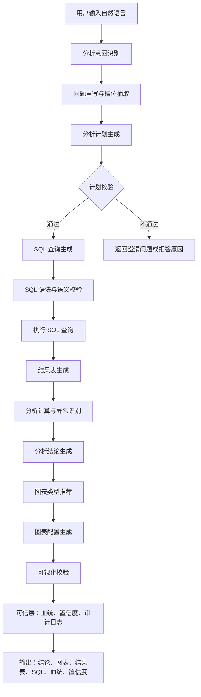
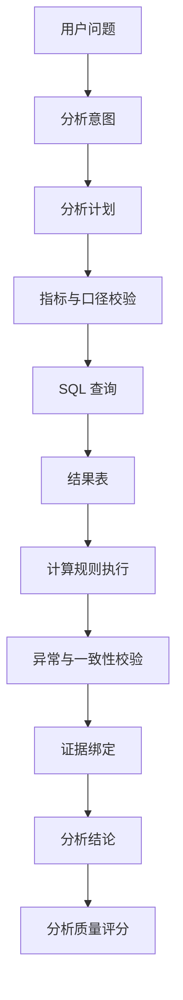

# 【v2.0】FinSafe-QA PRD

## 1. 项目概述

### 1.1 项目名称

FinSafe-QA V2.0

---

### 1.2 产品定位

FinSafe-QA V2.0 是一款面向金融投研场景的 AI 智能分析助手，在 V1.0 “可信问数”能力基础上，进一步强化数据分析质量与可视化表达能力。

核心链路升级为：

> 自然语言提问 → 分析意图识别 → SQL 自动生成 → 结构化数据查询 → 分析逻辑校验 → 洞察生成 → 可视化呈现 → 可信层输出

V2.0 帮助投研人员完成从“查数”到“看懂数据”的升级，重点解决金融分析中的结果质量、分析逻辑、异常识别和图表表达问题。

---

## 2. 项目背景

FinSafe-QA V1.0 已完成可信问数底座建设，能够支持自然语言转 SQL、结构化财务数据查询、SQL 可见、数据血统追溯和置信度标签等核心能力。

但在真实投研场景中，用户完成数据查询后，通常还需要继续处理以下问题：

- 这个指标变化是否显著？
- 同行业公司之间谁表现更好？
- 增长来自收入改善、利润率改善，还是费用控制？
- 结果适合用什么图表展示？
- 当前结论是否存在数据异常或口径风险？

这意味着系统不能停留在“查到数”，而需要进一步具备“分析数”和“表达数”的能力。

V2.0 围绕两个方向升级：

1. **提升数据分析质量**：引入分析计划、指标计算校验、异常识别、结论约束和多步骤分析链路，减少浅层总结和错误归因。
2. **增强数据可视化能力**：根据问题类型、数据结构和分析目标，自动推荐并生成合适图表，让用户更快识别趋势、对比、结构和异常。

---

## 3. 目标用户

FinSafe-QA V2.0 面向金融投研相关从业人员，包括研究员、分析师、基金经理和企业战略分析人员。

相比 V1.0，V2.0 更适合以下用户任务：

- 快速完成财务指标趋势分析。
- 对多家公司进行横向比较。
- 识别收入、利润、费用、现金流等关键指标异常。
- 将查询结果转化为可展示的图表和分析结论。
- 为投研简报、行业分析、产品演示提供可追溯的数据分析素材。

---

## 4. 用户痛点分析

| 痛点 | 具体表现 | V2.0 如何解决 |
| --- | --- | --- |
| 查到数据但难以判断含义 | 用户得到数值后仍需人工计算趋势、对比和异常 | 增加分析计划、同比/环比、排名、占比、波动识别等分析能力 |
| AI 分析结论容易空泛 | 只给出“有所提升”“表现较好”等泛化描述，缺少数据支撑 | 结论必须绑定数据证据，输出关键数值、变化幅度和依据 |
| 复杂分析链路不稳定 | 多指标、多公司、多周期问题容易遗漏步骤或错用口径 | 引入分析步骤拆解、指标依赖校验和结果一致性检查 |
| 图表选择成本高 | 用户不知道趋势、对比、结构、分布分别适合什么图 | 根据分析意图自动推荐折线图、柱状图、堆叠图、散点图等 |
| 可视化可信度不足 | 图表可能单位混乱、维度错误、标题与数据不一致 | 增加图表配置校验、单位展示、数据来源和可视化置信标签 |
| 分析结果难以复用 | 查询、SQL、图表和结论分散，无法形成完整分析记录 | 输出分析摘要、SQL、数据表、图表配置、血统和审计日志 |

---

## 5. 为什么继续使用大模型

V2.0 的核心任务不再只是自然语言到 SQL 的转换，而是进一步完成“分析意图理解、分析路径规划、图表选择和自然语言洞察生成”。

这些任务具有明显的长尾性和语义复杂性，仅依赖固定规则难以覆盖。

例如：

- “这几家 CXO 公司 2022 到 2025 年收入增长趋势怎么样？”
- “药明康德利润增长是不是主要靠费用下降？”
- “帮我看一下创新药公司里现金流压力最大的企业”
- “把这些公司的净利率变化画出来，并指出异常年份”

这类问题同时包含分析目标、指标映射、时间窗口、对比对象、计算逻辑和表达方式。大模型能够承担语义理解和分析规划角色，但最终计算与校验仍由结构化规则和可信层约束完成。

---

### 5.1 分析意图理解能力

V2.0 需要识别用户真实想完成的分析任务，而不只是提取公司、时间和指标。

| 用户表达 | 标准分析意图 |
| --- | --- |
| 增长趋势怎么样 | 时间序列趋势分析 |
| 谁表现最好 | 横向排名/对比分析 |
| 为什么利润变了 | 指标拆解/归因分析 |
| 有没有异常 | 波动检测/异常识别 |
| 画出来看看 | 可视化表达 |

---

### 5.2 分析计划生成能力

面对多步骤分析问题，大模型负责生成结构化分析计划，例如：

```json
{
  "analysis_goal": "比较多家公司收入增长趋势",
  "metrics": ["营业总收入", "同比增长率"],
  "dimensions": ["公司", "报告期"],
  "steps": [
    "查询各公司各报告期营业总收入",
    "计算同比增长率",
    "按公司生成趋势序列",
    "识别增长最快和波动最大的公司"
  ],
  "chart_type": "line"
}
```

系统再基于分析计划生成 SQL、执行查询、校验结果并生成可视化。

---

### 5.3 图表推荐与解释能力

不同分析问题需要不同可视化方式：

| 分析目标 | 推荐图表 | 说明 |
| --- | --- | --- |
| 趋势变化 | 折线图 | 展示指标随时间变化 |
| 公司对比 | 柱状图 | 展示同一指标在不同公司之间的差异 |
| 结构占比 | 饼图/堆叠柱状图 | 展示组成结构 |
| 双指标关系 | 散点图 | 展示相关性或离群点 |
| 多指标综合 | 雷达图/组合图 | 展示多维表现，但需控制指标数量 |

V2.0 中，大模型负责根据问题语义推荐图表类型，系统负责校验图表配置是否与数据结构匹配。

---

### 5.4 为什么不能只做固定 BI 看板

传统 BI 看板适合稳定、重复、标准化的分析场景，但金融投研中的自然语言问题往往是临时组合的。

固定看板存在以下限制：

| 问题 | 表现 |
| --- | --- |
| 分析问题长尾 | 用户问题并不总是对应预设图表 |
| 维度组合灵活 | 公司、行业、时间、指标经常动态变化 |
| 解释成本高 | 看板展示结果，但不一定解释结果含义 |
| 异常发现依赖人工 | 用户需要自己判断波动是否异常 |
| 复用链路不足 | 看板难以记录自然语言问题、SQL、结论和图表生成逻辑 |

因此，V2.0 采用：

> “大模型分析规划 + SQL 精准计算 + 规则可信校验 + 自动可视化”

而不是单纯固定 BI 看板或纯文本分析。

---

## 6. 竞品分析

### 6.1 WarrenQ（恒生聚源）

| 维度 | 做法 | 效果 |
| --- | --- | --- |
| 问数能力 | NL2API 路线，依赖预置金融指标 API | 标准问题准确率较高 |
| 分析能力 | 提供投顾、研报、问数等金融智能体能力 | 能覆盖部分复杂业务场景 |
| 可视化能力 | 以金融终端和数据产品形态呈现 | 图表能力强，但更偏专业终端 |

**局限：**

- 分析链路对普通用户不完全透明。
- 图表与分析结论之间的生成逻辑不一定可审计。
- NL2SQL、可信校验和可视化生成的完整实现细节不对外公开。

---

### 6.2 WindClaw / Alice（万得）

| 维度 | 做法 | 效果 |
| --- | --- | --- |
| 数据底座 | Wind 数据库和 MCP 工具封装 | 数据覆盖全面 |
| 分析形态 | 多智能体协同，支持底稿和任务流 | 更接近投研工作台 |
| 可视化能力 | 依赖终端内置图表和数据展示能力 | 专业度较高 |

**局限：**

- SQL 与工具调用细节通常不可见。
- 多智能体推理过程不一定可复现。
- 对数据分析质量的评测口径不透明。

---

### 6.3 V2.0 差异化机会

FinSafe-QA V2.0 的差异化不在于数据覆盖广度，而在于：

| 维度 | V2.0 设计重点 |
| --- | --- |
| 分析可信 | 每个分析结论必须绑定数据证据和计算过程 |
| 图表可信 | 每个图表保留数据来源、图表配置和单位说明 |
| 链路透明 | 用户可查看自然语言、分析计划、SQL、结果表、图表和结论 |
| 可评测 | 分析质量和可视化质量均纳入评测集与上线门禁 |
| 链路透明 | 用户可查看自然语言、分析计划、SQL、结果表、图表和结论的全链路 |

---

## 7. 系统整体设计

### 7.1 产品设计理念

FinSafe-QA V2.0 延续 V1.0 的可信原则，但产品目标从“查得准”升级为：

> 查得准、算得对、讲得清、画得明。

核心目标：

- 让自然语言稳定映射到分析计划。
- 让分析计划稳定映射到 SQL 和计算逻辑。
- 让分析结论必须基于可验证数据。
- 让图表表达与数据结构、问题意图保持一致。
- 让分析过程具备可解释、可复现和可评测能力。

---

### 7.2 系统流程图



---

### 7.3 V2.0 核心模块

| 模块 | 说明 |
| --- | --- |
| 分析意图识别 | 判断用户是查数、趋势分析、对比分析、归因分析、异常识别还是可视化需求 |
| 分析计划生成 | 将复杂问题拆解为指标、维度、时间、计算步骤和输出形式 |
| SQL 查询与执行 | 延续 V1.0 的白名单 SQL 生成和可信执行机制 |
| 分析计算层 | 负责同比、环比、排名、占比、均值、波动、异常等计算 |
| 结果质量校验 | 校验单位、空值、极值、时间连续性、指标口径和计算一致性 |
| 洞察生成层 | 基于结果表生成数据驱动结论，不允许脱离数据自由发挥 |
| 图表推荐层 | 根据分析目标和数据结构推荐图表类型 |
| 图表配置层 | 生成图表标题、轴、图例、单位、数据序列和排序规则 |
| 可视化校验层 | 校验图表类型是否适配数据，防止维度错配和单位混乱 |

---

## 8. 数据分析质量体系

### 8.1 设计目标

V2.0 的数据分析质量由“分析计划 + SQL 结果 + 计算规则 + 结论约束 + 异常校验”共同保证，大模型不直接参与数值判断。

---

### 8.2 分析质量流程图



---

### 8.3 分析质量评估维度

| 维度 | 说明 |
| --- | --- |
| 意图匹配度 | 分析计划是否符合用户真实问题 |
| 指标口径正确性 | 指标映射、单位和时间口径是否正确 |
| 计算正确性 | 同比、环比、排名、占比等计算是否正确 |
| 证据完整性 | 结论是否引用关键数值、时间和对比对象 |
| 异常识别能力 | 是否能识别明显波动、缺失值、离群点 |
| 结论克制度 | 是否避免无数据支撑的主观归因和投资建议 |

---

### 8.4 分析结论输出规范

V2.0 的分析结论必须遵循以下规则：

| 规则 | 要求 |
| --- | --- |
| 先结论后证据 | 先给出核心发现，再给出关键数据依据 |
| 数值必须可追溯 | 每个关键判断必须对应结果表中的数据 |
| 区分事实与推测 | 事实基于结构化数据，推测必须明确标注 |
| 避免过度归因 | 没有费用、收入、毛利率等拆解数据时，不得强行解释原因 |
| 保留风险提示 | 数据缺失、口径不明、样本过少时必须提示 |

示例：

```text
结论：2022-2025 年，A 公司营业收入整体呈下降趋势，其中 2024 年降幅最明显。

数据依据：
- 2022 年营业收入为 X 亿元。
- 2023 年营业收入为 Y 亿元，同比变化为 -a%。
- 2024 年营业收入为 Z 亿元，同比变化为 -b%。

风险提示：
- 当前结论仅基于公开财务数据，未引入订单、产能和行业景气度信息，不能单独作为经营归因结论。
```

---

## 9. 可视化体系

### 9.1 设计目标

V2.0 的可视化服务于金融分析理解，要求每张图表保留数据来源、图表配置和单位说明。

核心目标：

- 帮助用户快速发现趋势、差异、结构和异常。
- 图表必须与问题意图和数据结构匹配。
- 图表必须保留单位、口径、数据来源和图表配置。
- 图表必须能与 SQL、结果表和分析结论互相验证。

---

### 9.2 图表推荐规则

| 问题类型 | 数据结构 | 推荐图表 | 不推荐 |
| --- | --- | --- | --- |
| 单公司多期趋势 | 时间 + 指标 | 折线图 | 饼图 |
| 多公司单期对比 | 公司 + 指标 | 柱状图 | 折线图 |
| 多公司多期趋势 | 公司 + 时间 + 指标 | 多折线图 | 饼图 |
| 指标结构占比 | 类别 + 数值 | 堆叠柱状图/饼图 | 折线图 |
| 双指标关系 | 指标 A + 指标 B + 公司 | 散点图 | 饼图 |
| 排名 TopN | 对象 + 指标 | 横向柱状图 | 雷达图 |
| 异常波动 | 时间 + 指标 + 变化率 | 折线图 + 异常标记 | 饼图 |

---

### 9.3 图表配置规范

每个图表输出需包含：

| 字段 | 说明 |
| --- | --- |
| chart_type | 图表类型 |
| title | 图表标题 |
| x_axis | X 轴字段 |
| y_axis | Y 轴字段 |
| series | 数据系列 |
| unit | 单位 |
| source | 数据来源 |
| sql_id | 对应查询 ID |
| insight | 图表对应的核心洞察 |
| warnings | 数据缺失、单位不一致、样本过少等提示 |

示例：

```json
{
  "chart_type": "line",
  "title": "2022-2025 年主要 CXO 公司营业收入趋势",
  "x_axis": "报告期",
  "y_axis": "营业总收入",
  "series": "公司名称",
  "unit": "亿元",
  "source": "AkShare / 同花顺公开财务数据",
  "sql_id": "query_20260524_001",
  "insight": "部分公司在 2024 年后收入增长明显放缓",
  "warnings": ["2025 年仅包含三季报数据，与年度数据不可直接等同"]
}
```

---

## 10. 置信度体系升级

### 10.1 设计目标

V2.0 的置信度从 V1.0 的“查询可信度”升级为“查询 + 分析 + 可视化”综合可信度。

---

### 10.2 置信度组成

| 模块 | 作用 |
| --- | --- |
| 意图置信度 | 判断分析意图是否明确 |
| SQL 置信度 | 判断 SQL 是否符合语法和白名单规则 |
| 数据结果置信度 | 判断查询结果是否完整、合理、无明显异常 |
| 分析计算置信度 | 判断同比、环比、排名、占比等计算是否正确 |
| 结论置信度 | 判断结论是否基于证据，是否存在过度归因 |
| 图表置信度 | 判断图表类型、字段映射和单位是否正确 |
| 历史稳定性 | 判断类似问题历史表现是否稳定 |

---

### 10.3 最终计算公式

```text
最终置信度 =
    0.15 × 意图置信度
  + 0.20 × SQL 置信度
  + 0.15 × 数据结果置信度
  + 0.15 × 分析计算置信度
  + 0.15 × 结论置信度
  + 0.10 × 图表置信度
  + 0.10 × 历史稳定性
  - 复杂度惩罚
```

---

### 10.4 用户侧展示

```text
🟡 中置信

原因：
- SQL 已通过语法与语义校验。
- 结果表中 2025 年仅包含三季报数据，与年度数据存在口径差异。
- 图表字段映射正确，但跨年度对比需提示周期差异。
- 分析结论仅基于财务数据，不包含行业景气度和公司经营事件。
```

---

## 11. 项目评测

V2.0 评测在 V1.0 准确性、系统性、可回溯性基础上，新增“分析质量”和“可视化质量”两类评测维度。

| 评测维度 | 评测重点 | 上线指标 |
| --- | --- | --- |
| 准确性 | 自然语言问题是否正确转化为 SQL，查询结果是否与标准答案一致 | 1 级问题准确率 ≥ 99%；2 级问题准确率 ≥ 92%；3 级问题通过率 ≥ 75%；致命错误率 = 0%；静默错误率 ≤ 4% |
| 系统性 | 是否覆盖查数、趋势、对比、排名、同比/环比、异常识别、图表生成等场景 | 核心场景覆盖率 = 100%；自动回归通过率 = 100%；模型升级后准确率下降 ≤ 5% |
| 可回溯性 | SQL、数据血统、分析计划、图表配置和审计日志是否完整 | SQL 可见率 = 100%；分析计划记录率 = 100%；图表配置记录率 = 100%；SQL 可回放成功率 ≥ 95% |
| 分析质量 | 计算是否正确，结论是否有证据，是否避免过度归因 | 分析计算正确率 ≥ 95%；结论证据绑定率 ≥ 95%；过度归因率 ≤ 5% |
| 可视化质量 | 图表类型、字段映射、单位、标题和洞察是否正确 | 图表推荐准确率 ≥ 90%；图表配置有效率 ≥ 95%；单位展示完整率 = 100% |

---

### 11.1 V2.0 评测问题集设计

V2.0 评测集应在 V1.0 的 103 条问题基础上扩展，新增以下类型：

| 问题类型 | 示例 | 评测重点 |
| --- | --- | --- |
| 趋势分析 | “药明康德 2022-2025 年营业收入趋势怎么样？” | 时间序列、同比、结论证据 |
| 横向对比 | “这几家公司 2025 年前三季度谁的净利率最高？” | 多公司对比、排序、单位 |
| 异常识别 | “哪些公司 2024 年净利润波动最大？” | 变化率、异常阈值、风险提示 |
| 指标拆解 | “利润下降是收入下降还是费用上升导致的？” | 多指标拆解、克制归因 |
| 可视化生成 | “把 CXO 公司近三年收入画成趋势图” | 图表推荐、字段映射、图表配置 |
| 图表解释 | “这张图说明了什么？” | 图表洞察、证据绑定 |

---

### 11.2 V2.0 上线门禁

| 门禁项 | 要求 |
| --- | --- |
| V1.0 核心查数能力 | 不得低于 V1.0 上线指标 |
| 分析计划生成 | 核心分析场景计划有效率 ≥ 95% |
| 分析计算 | 同比、环比、排名、占比计算正确率 ≥ 95% |
| 分析结论 | 结论证据绑定率 ≥ 95%，不得出现无依据投资建议 |
| 图表生成 | 图表配置有效率 ≥ 95%，单位展示完整率 = 100% |
| 可追溯 | 每次分析均记录 SQL、分析计划、结果表和图表配置 |

---

## 12. 版本边界

### 12.1 V2.0 做什么

| 能力 | 说明 |
| --- | --- |
| 趋势分析 | 支持单公司/多公司多期指标趋势分析 |
| 对比分析 | 支持多公司、多指标横向对比和 TopN 排名 |
| 基础归因 | 支持基于结构化财务指标的初步拆解 |
| 异常识别 | 支持对缺失值、极端值、明显波动进行提示 |
| 自动可视化 | 支持折线图、柱状图、横向柱状图、散点图、堆叠图等 |
| 图表解释 | 支持基于图表数据生成简洁洞察 |
| 分析可信层 | 支持分析计划、计算过程、图表配置和审计日志 |

---

### 12.2 V2.0 不做什么

| 不做项 | 原因 |
| --- | --- |
| 不输出投资建议 | 避免合规风险，系统只做数据分析辅助 |
| 不承诺完整经营归因 | 结构化财务数据不足以解释所有经营变化 |
| 不做实时行情交易决策 | 当前数据源以公开财务数据为主，不适合实时交易 |
| 不做复杂研报自动生成 | V2.0 聚焦分析质量和可视化，不扩展成长篇研报生产 |
| 不追求全市场数据覆盖 | V2.0 优先验证产品链路和可信机制 |

---

## 13. 总结

FinSafe-QA V2.0 在 V1.0 “可信问数助手”的基础上，进一步升级为“可信数据分析助手”。

V2.0 的核心价值是：

- 不只返回数据，而是生成可验证的数据洞察。
- 不只展示 SQL，而是展示完整分析计划和计算过程。
- 不只输出文字，而是提供适配问题意图的可视化图表。
- 不只追求 AI 表达能力，而是将分析质量和可视化质量纳入评测门禁。

通过 V2.0，FinSafe-QA 能更完整地展示金融 AI 产品从自然语言问数、可信计算、数据分析到图表表达的端到端能力。
