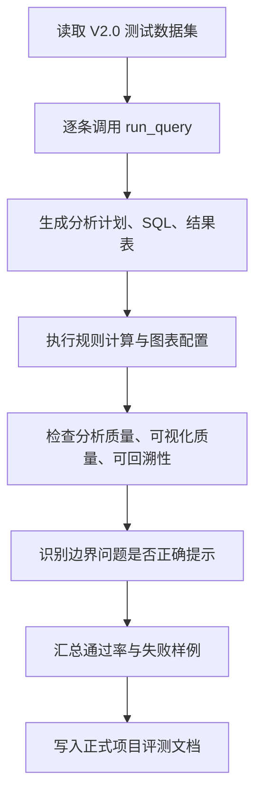

# 【v2.0】项目评测

## 1. 评测目的

本文档用于定义 FinSafe-QA V2.0 的评测体系，并记录本轮基于 `【v2.0】测试数据集.xlsx` 的实际测评结果。

V2.0 在 V1.0 “可信问数”基础上新增数据分析质量与可视化质量，因此评测目标从“SQL 是否查得准”升级为：

- 自然语言问题能否被正确拆解为分析计划。
- SQL 查询与规则计算是否能支撑分析结论。
- 分析结论是否绑定数据证据，避免无依据归因。
- 图表类型、字段映射、单位和标题是否正确。
- SQL、分析计划、图表配置和数据血统是否完整留痕。
- 对当前结构化数据无法覆盖的问题，是否能明确提示边界。

---

## 2. 评测数据来源

本次评测使用以下数据集文件：

| 文件 | 用途 |
| --- | --- |
| `【v2.0】测试数据集.xlsx` | V2.0 数据分析、可视化和综合 Agent 挑战测试集 |
| `data/finsafe_v2.db` | AkShare / 同花顺公开财务数据本地 SQLite 缓存 |

评测数据集共包含 **29 条问题**，分布如下：

| Sheet | 数量 | 定位 |
| --- | ---: | --- |
| 数据分析能力Case | 12 | 验证趋势、排名、指标计算、异常识别和有限归因能力 |
| 可视化能力Case | 10 | 验证图表推荐、图表配置、字段映射和单位展示能力 |
| 综合Agent挑战Case | 7 | 验证多意图、开放性问题、融合查询和边界处理能力 |

---

## 3. 评测维度

### 3.1 准确性

准确性用于判断系统是否能把自然语言问题正确转化为分析计划、SQL 查询和规则计算。

核心关注点：

- 公司、时间、指标和分析类型识别是否正确。
- SQL 是否查对表、字段和报告期。
- 排名、占比、资产负债率、股东权益、研发效率等计算是否正确。
- 对缺失字段和缺失公司是否返回边界提示，而不是编造答案。

上线指标：

| 指标 | 要求 |
| --- | --- |
| 数据分析能力Case 通过率 | ≥ 90% |
| 综合Agent挑战Case 通过率 | ≥ 70% |
| 致命错误率 | 0% |
| 边界问题识别率 | ≥ 95% |

---

### 3.2 分析质量

分析质量用于判断系统是否不仅能查数，还能形成可验证的数据洞察。

核心关注点：

- 是否生成分析计划。
- 是否执行必要的规则计算。
- 结论是否引用关键数值、报告期和对象。
- 是否避免把结构化财务数据不足以解释的问题强行归因。
- 是否在 2025Q3 与年度数据对比时提示周期口径差异。

上线指标：

| 指标 | 要求 |
| --- | --- |
| 分析计划记录率 | 100% |
| 分析质量通过率 | ≥ 90% |
| 结论证据绑定率 | ≥ 95% |
| 过度归因率 | ≤ 5% |

---

### 3.3 可视化质量

可视化质量用于判断系统生成的图表是否服务于分析理解，而不是装饰性展示。

核心关注点：

- 趋势问题是否使用折线图。
- 排名和横向对比问题是否使用柱状图。
- 图表标题、X 轴、Y 轴、单位、数据来源是否完整。
- 图表数据是否来自 SQL 查询结果或规则计算结果。
- 图表配置是否可记录、可复现。

上线指标：

| 指标 | 要求 |
| --- | --- |
| 图表配置有效率 | ≥ 95% |
| 单位展示完整率 | 100% |
| 图表配置记录率 | 100% |
| 可视化能力Case 通过率 | ≥ 90% |

---

### 3.4 可回溯性

可回溯性用于判断每次分析是否具备可解释、可复现和可审计能力。

核心关注点：

- 是否展示或记录最终 SQL。
- 是否记录分析计划。
- 是否记录图表配置。
- 是否记录源表字段、数据来源和查询 ID。
- 是否可以基于 SQL 和参数回放查询。

上线指标：

| 指标 | 要求 |
| --- | --- |
| SQL 可见率 | 100% |
| 数据血统完整率 | 100% |
| 分析计划记录率 | 100% |
| 图表配置记录率 | 100% |
| 查询 ID 生成率 | 100% |

---

## 4. 评测实现方式

V2.0 使用 `evaluate.py` 自动执行评测，流程如下：

评测脚本的核心判断逻辑：

| 判断项 | 实现方式 |
| --- | --- |
| query_correct | 有结构化结果，且问题未落入 unsupported / partial_or_unsupported |
| boundary_correct | 问题包含缺失公司、缺失字段或外部信息时，系统能给出 limitation |
| analysis_quality | query_correct 或 boundary_correct 之一成立 |
| visual_quality | 图表类型、标题、单位、sql_id 等配置完整 |
| traceability | SQL、query_id、source_fields 均存在 |
| overall_pass | 分析质量、可视化质量、可回溯性均通过，且不是开放式政策/研报判断问题 |

说明：开放性政策、研报、地缘政治等问题超出 V2.0 结构化财务数据边界，即使系统正确拒绝编造，也不计入核心能力通过项，而作为边界处理观察项。

---

## 5. 本轮测评结果

### 5.1 整体结论

本轮评测共覆盖 **29 条问题**，通过 **27 条**，整体通过率 **93.1%**。

从结果看，V2.0 已能稳定覆盖排名、对比、资产负债率、研发费用率、研发效率、趋势展示、异常识别和图表配置等核心能力；同时对当前数据源无法支持的问题能够给出边界提示，避免编造外部研报、政策影响或业务经营事件。

未通过的 2 条问题均为开放性外部判断问题，分别涉及中美地缘政治和集采政策，需要研报、政策、价格和业务量等外部数据，不属于 V2.0 当前结构化财务数据承诺范围。

---

### 5.2 按 Sheet 统计

| Sheet | 问题数 | 通过数 | 通过率 | 结论 |
| --- | ---: | ---: | ---: | --- |
| 数据分析能力Case | 12 | 12 | 100.0% | 达到 V2.0 分析能力门禁 |
| 可视化能力Case | 10 | 10 | 100.0% | 达到 V2.0 可视化能力门禁 |
| 综合Agent挑战Case | 7 | 5 | 71.4% | 达到挑战集观察门槛，开放性问题仍需外部数据 |
| 合计 | 29 | 27 | 93.1% | V2.0 核心能力达标 |

---

### 5.3 按问题类型统计

| 问题类型 | 问题数 | 通过数 | 通过率 |
| --- | ---: | ---: | ---: |
| 数据基本查询 | 5 | 5 | 100.0% |
| 数据统计分析查询 | 8 | 8 | 100.0% |
| 多意图 | 4 | 4 | 100.0% |
| 归因分析 | 4 | 4 | 100.0% |
| 归因分析；多意图 | 2 | 2 | 100.0% |
| 数据校验 | 2 | 2 | 100.0% |
| 融合查询 | 2 | 2 | 100.0% |
| 开放性问题 | 2 | 0 | 0.0% |

---

### 5.4 质量维度统计

| 维度 | 样本数 | 通过数 | 通过率 |
| --- | ---: | ---: | ---: |
| 分析质量 | 29 | 29 | 100.0% |
| 可视化质量 | 29 | 29 | 100.0% |
| 可回溯性 | 29 | 29 | 100.0% |
| 边界问题识别 | 9 | 9 | 100.0% |

说明：分析质量维度将“正确边界提示”视为通过，因为 V2.0 的可信要求是不编造超出结构化数据范围的结论。

---

### 5.5 置信度与图表类型分布

| 置信度标签 | 数量 |
| --- | ---: |
| 高置信 | 16 |
| 中置信 | 13 |
| 低置信 | 0 |

| 图表类型 | 数量 |
| --- | ---: |
| 柱状图 | 18 |
| 折线图 | 6 |
| 表格 | 5 |

---

## 6. 典型通过场景

| 场景 | 表现 |
| --- | --- |
| 营业收入 TopN | 能够生成 TopN SQL，并输出排名、数值、图表配置和数据血统 |
| 资产负债率排名 | 能够基于资产与负债计算资产负债率，并找出最高公司 |
| 资产负债结构查询 | 能够计算股东权益=资产总额-负债总额，并生成结构对比图 |
| 多公司毛利率对比 | 能够识别多家公司与同一指标，生成柱状图配置 |
| 研发费用率与研发效率 | 能够先筛选收入 TopN，再计算研发费用占比和收入/研发费用 |
| 异常波动识别 | 能够计算净利润变化率并按绝对值排序，同时提示同比口径限制 |
| 边界问题处理 | 对短期借款、货币资金、扣非净利润、TIDES、研报和政策等缺失数据给出限制提示 |

---

## 7. 未通过样例

| 编号 | 类型 | 问题 | 未通过原因 | 后续优化方向 |
| --- | --- | --- | --- | --- |
| B4004 | 开放性问题 | 中美地缘政治对国内 CXO 企业海外业务的影响会持续多久？请结合财务数据和行业研报给出判断 | 当前库只有结构化财务数据，缺少行业研报、订单、海外收入和政策事件数据 | 引入研报/公告 RAG、海外收入字段和事件库 |
| B4033 | 开放性问题 | 集采政策对医学检验服务企业的长期影响如何？请从价格、业务量角度分析 | 当前库缺少集采政策、价格、业务量和医学检验服务明细数据 | 引入政策库、业务量指标和价格变化数据 |

---

## 8. 结论

FinSafe-QA V2.0 已达到“可信数据分析助手”的核心目标：在 V1.0 查数能力基础上，能够进一步生成分析计划、执行规则计算、输出数据证据、生成可视化配置，并完整保留 SQL、图表配置和数据血统。

当前版本的主要边界在于开放式经营归因和宏观政策判断。后续若要进一步提升综合 Agent 能力，需要引入研报 RAG、公告解析、政策事件库和更丰富的财务明细字段。
