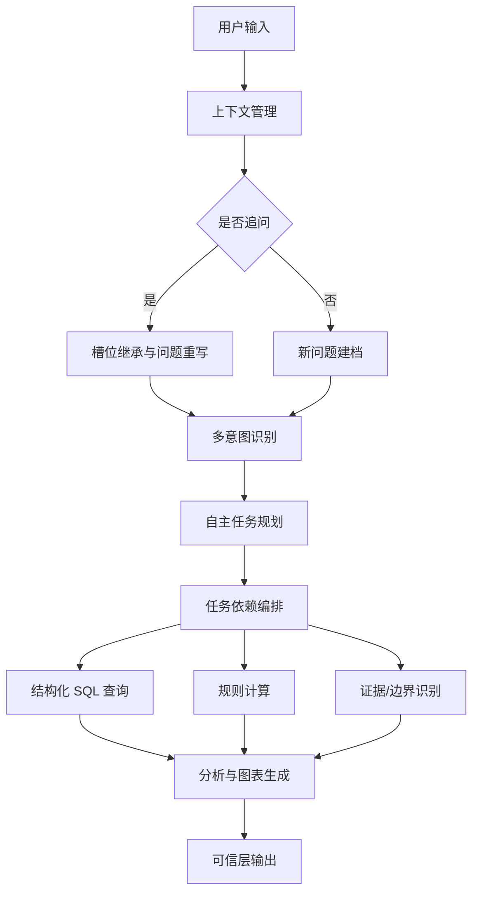

# 【v3.0】FinSafe-QA PRD

## 1. 项目概述

### 1.1 项目名称

FinSafe-QA V3.0

---

### 1.2 产品定位

FinSafe-QA V3.0 是一款面向金融投研复杂分析场景的上下文增强型 AI 问数助手。

在 V1.0 “可信问数”和 V2.0 “数据分析 + 可视化”的基础上，V3.0 重点引入两个能力：

1. **上下文管理模块**：支持多轮追问、槽位继承、问题改写和会话状态记录。
2. **多意图自主规划模块**：将复杂问题拆解为查询、计算、证据/边界、分析、可视化等子任务，并生成串并行执行计划。

核心链路升级为：

> 用户问题 → 上下文管理 → 问题重写 → 多意图识别 → 自主任务规划 → SQL/计算/证据/图表执行 → 可信层输出

V3.0 的目标不是重新证明查数准确性或图表能力，而是证明系统具备处理真实投研对话中“追问”和“复合问题”的产品能力。

---

## 2. 版本演进逻辑

本项目按三层架构递进：先验证数据准确性，再扩展分析能力，最后构建 Agent 工作流。

| 版本 | 核心目标 | 为什么先做这一层 |
| --- | --- | --- |
| V1.0 | 可信问数 | 先证明自然语言能稳定映射到 SQL，解决金融 AI 最核心的准确性和可追溯问题 |
| V2.0 | 分析质量与可视化 | 在查数可信后，进一步解决“查到数但看不懂”的问题 |
| V3.0 | 上下文管理与自主规划 | 在单轮分析可用后，面向真实投研对话，解决追问、多意图和复杂任务拆解问题 |

这一路径对应一个真实 AI 产品的风险控制顺序：

1. 先控制数据准确性风险。
2. 再控制分析表达风险。
3. 最后扩大到复杂 Agent 工作流。

---

## 3. 项目背景

V2.0 已经能处理趋势分析、对比分析、排名、基础归因、异常识别和自动可视化。但在真实投研过程中，用户很少只问一个完整的单轮问题，常见交互更接近：

- “药明康德 2025Q3 收入是多少？”
- “那净利润呢？”
- “和凯莱英比呢？”
- “画个趋势图。”
- “为什么利润率变化这么大？”

此外，复杂投研问题往往包含多个动作：

```text
① 查询收入 Top3 公司；
② 计算研发费用占比；
③ 找出研发效率最高的公司；
④ 解释可能原因。
```

如果系统没有上下文管理，就无法理解“那”“这些公司”“它们”等省略表达；如果没有自主规划，就容易漏掉子任务、错排依赖或把需要外部证据的问题当成普通查数。

因此，V3.0 的重点是让系统从“单轮分析工具”升级为“多轮任务型助手”。

---

## 4. 目标用户

V3.0 面向需要连续分析和复杂任务拆解的用户：

- 投研分析师：连续追问公司财务表现、对比对象和原因解释。
- 行业研究员：拆解多步骤行业问题，区分结构化数据和外部证据边界。

---

## 5. 用户痛点分析

| 痛点 | 具体表现 | V3.0 如何解决 |
| --- | --- | --- |
| 多轮追问容易断上下文 | “那净利润呢”“和它比呢”缺少公司、指标或时间 | 通过上下文管理继承最近 3 轮关键槽位 |
| 复杂问题容易漏步骤 | 多个查询、计算、分析、画图动作混在一句话里 | 自主规划模块拆成子任务并记录依赖关系 |
| 子任务顺序不清 | 先分析后查数、先画图后计算，导致结果不可信 | 执行计划强制“查询 → 计算 → 分析/图表” |
| 外部证据需求混入结构化查询 | 研报、政策、业务量、TIDES 等数据不在当前库 | 规划为 evidence_or_boundary 任务并提示边界 |
| 复杂 Agent 不可解释 | 用户只看到最终回答，不知道系统怎么拆解 | 输出 agent_plan、execution_batches 和上下文继承信息 |

---

## 6. 核心功能需求

### 6.1 上下文管理模块

| 功能 | 说明 |
| --- | --- |
| 会话状态记录 | 保存最近 3 轮公司、指标、报告期、分析类型和原始问题 |
| 追问识别 | 识别“那…呢”“和…比”“继续”“这些公司”“它们”等追问模式 |
| 槽位继承 | 当前问题缺公司、指标或时间时，从上一轮继承 |
| 问题重写 | 将省略式追问改写为完整问题 |
| 防过度继承 | 对带有 ①②③ 的完整复杂问题，不误判为追问 |

---

### 6.2 多意图自主规划模块

| 功能 | 说明 |
| --- | --- |
| 子任务拆解 | 根据 ①②③、分号、多问句等结构拆分子任务 |
| 任务分类 | 将子任务归类为 query、calculation、evidence_or_boundary、analysis、visualization |
| 依赖编排 | 为每个任务生成 depends_on，保证先查数再计算，再分析或画图 |
| 串并行批次 | 输出 execution_batches，便于展示 Agent 执行链路 |
| 自动补任务 | 当归因或复杂问题缺少 query/calculation/evidence 任务时自动补齐 |

---

## 7. 系统整体设计



---

## 8. 输出结构

V3.0 在 V2.0 输出基础上新增：

| 字段 | 说明 |
| --- | --- |
| rewritten_question | 经上下文补全后的问题 |
| context | 是否追问、继承槽位、会话 ID、历史轮数 |
| agent_plan | 子任务拆解、任务类型、依赖关系、执行批次 |
| trust.audit.context_recorded | 是否记录上下文 |
| trust.audit.agent_plan_recorded | 是否记录自主规划 |

---

## 9. 版本边界

V3.0 重点验证新增 Agent 能力，不把所有复杂问题都强行回答完整。

| 做什么 | 不做什么 |
| --- | --- |
| 支持多轮追问和槽位继承 | 不保证跨无限历史轮次记忆 |
| 支持复杂问题拆解和依赖编排 | 不承诺所有子任务都有当前数据可执行 |
| 支持证据/边界任务识别 | 不接入完整研报、政策、业务明细知识库 |
| 支持规划链路展示 | 不做真实多 Agent 并发执行调度 |

---

## 10. 成功标准

| 指标 | 目标 |
| --- | --- |
| 上下文记录完整率 | 100% |
| 复杂问题拆解率 | ≥ 95% |
| 任务类型识别准确率 | ≥ 90% |
| 任务依赖有效率 | 100% |
| 多轮追问处理率 | ≥ 90% |
| 规划链路可追溯率 | 100% |

---

## 11. 总结

FinSafe-QA V3.0 是整个项目从“AI 工具”迈向“AI Agent”的关键版本。

它将复杂金融分析从黑盒回答升级为可控、可解释、可评测的 Agent 工作流。

