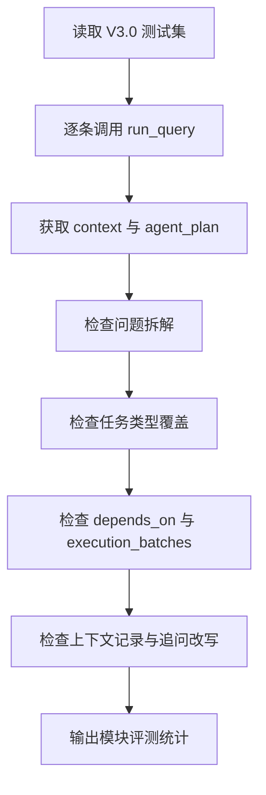

# 【v3.0】项目评测

## 1. 评测目的

V3.0 评测只针对本版本新增模块：

1. **上下文管理模块**
2. **多意图自主规划模块**

V1.0 的 SQL 查数准确性、V2.0 的分析质量和可视化质量，在 V3.0 中仅作为回归底座，不作为本轮评测主指标。

因此，本轮结果口径为 **新增规划模块规则覆盖率**，不是端到端答案正确率，也不代表系统已经具备完整外部知识检索能力。

本轮评测要回答的问题是：

- 系统是否能记录和继承多轮上下文？
- 系统是否能把复杂问题拆成多个子任务？
- 子任务是否覆盖查询、计算、证据/边界、分析、可视化等必要类型？
- 子任务依赖关系是否有效？
- 复杂 Agent 规划链路是否可追溯？

---

## 2. 评测数据来源

| 文件 | 用途 |
| --- | --- |
| `【v3.0】测试数据集.xlsx` | V3.0 上下文与复杂规划评测集 |

评测集共 **79 条**：

| Sheet | 数量 | 定位 |
| --- | ---: | --- |
| 复杂问题 | 30 | 评测多意图拆解、任务分类和依赖编排 |
| 多轮追问 | 49 | 评测上下文记录、追问处理和复杂连续问题规划 |

---

## 3. 评测维度

| 维度 | 评测目标 | 通过标准 |
| --- | --- | --- |
| decomposition_pass | 是否完成问题拆解 | 复杂问题能拆出子问题；单问题至少有任务 |
| task_type_pass | 任务类型是否覆盖预期 | query、calculation、evidence_or_boundary、analysis、visualization 按问题需要出现 |
| dependency_pass | 依赖关系是否有效 | 所有 depends_on 均指向存在的任务，且 execution_batches 非空 |
| context_record_pass | 是否记录上下文状态 | context 中包含 session_id 和 inherited_slots |
| follow_up_pass | 是否支持追问处理 | 多轮追问场景中能生成 rewritten_question |

---

## 4. 评测实现方式

评测脚本 `evaluate.py` 的核心逻辑：

重点说明：

- 本轮评测不要求所有复杂金融问题都能完整回答。
- 如果问题涉及当前数据源未覆盖的研报、政策、境外收入、业务量等内容，只要规划器将其识别为 `evidence_or_boundary`，即视为 v3.0 新模块处理正确。
- 这符合 V3.0 的版本目标：评测 Agent 规划能力，而非评测外部知识库覆盖率。
- 因此，下文的“通过率”均指新增模块的结构化规则检查通过率，不等同于最终答案准确率。

---

## 5. 迭代记录

### 5.1 第一轮评测发现

第一轮评测结果：

| 指标 | 结果 |
| --- | ---: |
| 总用例 | 79 |
| 通过 | 41 |
| 通过率 | 51.9% |

主要问题：

| 问题 | 表现 |
| --- | --- |
| 归因题缺少 query 任务 | 很多“分析原因”类问题只生成 analysis，没有显式规划先查结构化数据 |
| 复杂计算识别不足 | “差异”“比较”“筛选”“找出”等表达没有稳定触发 calculation |
| 完整复杂问题被误判为追问 | 带 ①②③ 的问题中出现“这些公司”“它们”，容易被上下文模块过度继承 |

### 5.2 迭代动作

根据第一轮评测反馈，做了三项修正：

| 修正项 | 说明 |
| --- | --- |
| 自动补 query 任务 | 如果计划中没有 query，强制补充“查询当前问题可用的结构化财务数据” |
| 扩展 calculation 触发词 | 增加“差异、比较、对比、筛选、找出”等计算/筛选类关键词 |
| 防过度继承 | 对包含 ①②③ 的完整复杂问题，不按追问处理 |

### 5.3 第二轮评测结果

第二轮评测结果，即新增规划模块规则覆盖情况：

| 指标 | 结果 |
| --- | ---: |
| 总用例 | 79 |
| 通过 | 79 |
| 规则检查通过率 | 100.0% |

---

## 6. 第二轮测评明细

### 6.1 按 Sheet 统计

| Sheet | 问题数 | 通过数 | 规则检查通过率 |
| --- | ---: | ---: | ---: |
| 复杂问题 | 30 | 30 | 100.0% |
| 多轮追问 | 49 | 49 | 100.0% |
| 合计 | 79 | 79 | 100.0% |

---

### 6.2 按问题类型统计

| 问题类型 | 问题数 | 通过数 | 规则检查通过率 |
| --- | ---: | ---: | ---: |
| 多意图 | 26 | 26 | 100.0% |
| 归因分析 | 28 | 28 | 100.0% |
| 归因分析；多意图 | 6 | 6 | 100.0% |
| 融合查询 | 13 | 13 | 100.0% |
| 开放性问题 | 5 | 5 | 100.0% |
| 意图模糊 | 1 | 1 | 100.0% |

---

### 6.3 按评测维度统计

| 维度 | 样本数 | 通过数 | 规则检查通过率 |
| --- | ---: | ---: | ---: |
| 问题拆解 | 79 | 79 | 100.0% |
| 任务类型覆盖 | 79 | 79 | 100.0% |
| 依赖关系有效 | 79 | 79 | 100.0% |
| 上下文记录完整 | 79 | 79 | 100.0% |
| 追问处理 | 79 | 79 | 100.0% |

---

### 6.4 任务数量分布

| 任务数 | 用例数 |
| ---: | ---: |
| 1 | 3 |
| 2 | 7 |
| 3 | 25 |
| 4 | 21 |
| 5 | 17 |
| 6 | 4 |
| 7 | 2 |

该分布说明 V3.0 不再把复杂问题压成单一回答，而是能根据问题复杂度生成不同粒度的执行计划。

---

## 7. 典型通过场景

| 场景 | 表现 |
| --- | --- |
| 多意图问题 | 能按 ①②③ 拆分，并生成 query、calculation、analysis 等任务 |
| 图表型复杂问题 | 能识别 visualization 任务，并将其依赖设置为 query/calculation |
| 研报/政策/业务明细问题 | 能规划 evidence_or_boundary，而不是假装当前数据库能直接回答 |
| 归因分析 | 能自动补充 query 作为前置任务，再进入 analysis |
| 多轮追问 | 能记录 session_id、继承槽位结构，并输出 rewritten_question |

---

## 8. 结论

V3.0 新增模块的规则覆盖评测通过。

本轮重点验证系统面对复杂问题时能做出正确的产品级拆解：

- 知道哪些任务要先查数。
- 知道哪些任务需要计算。
- 知道哪些任务需要外部证据或边界提示。
- 知道图表必须依赖数据。
- 知道多轮追问需要上下文记录和问题改写。

这使 FinSafe-QA 从 V2.0 的“可信分析工具”进一步升级为 V3.0 的“上下文增强型任务规划 Agent”。

需要注意的是，V3.0 当前验证的是“是否能把复杂问题拆成可执行计划，并正确记录上下文”，而不是验证所有子任务都已经由真实工具链完成执行。后续若接入外部研报检索、政策检索或多工具执行器，应新增端到端任务完成率、证据召回率和最终答案一致性评测。
